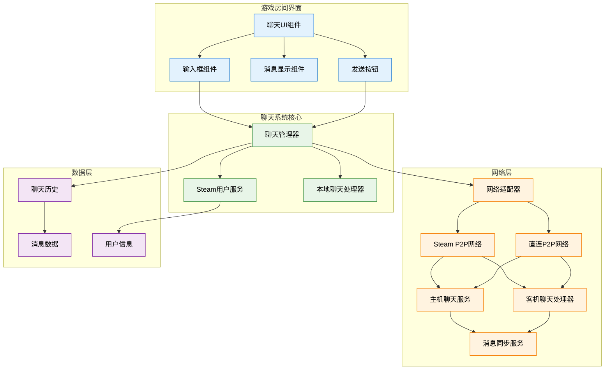

# 游戏内房间聊天系统设计文档

## 概述

游戏内房间聊天系统是一个集成在游戏房间界面中的实时聊天解决方案，采用主机-客机架构实现多人聊天功能。系统分为四个主要阶段：本地聊天 UI 实现、主机聊天服务、客机聊天通信和聊天历史同步。

## 架构

### 系统架构图



### 核心组件

#### 1. 聊天 UI 组件 (Chat UI Component)

**职责**: 提供聊天显示和全屏输入交互功能
**功能**:

-   房间界面中的聊天记录显示
-   全屏聊天输入覆盖层管理
-   消息显示区域和滚动控制
-   全局输入焦点管理和事件阻止
-   覆盖层与游戏界面的协调

### 房间界面布局设计

#### 默认房间界面（包含聊天区域）

```
┌─────────────────────────────────────────────────────────────┐
│  ← 房间名称: 我的游戏房间                                ✕  │
├─────────────────────────────────────────────────────────────┤
│                                                             │
│  房间可见性: [公开] [好友] [邀请]                            │
│                                                             │
│  房间密码: [___________________]  (留空为无密码)             │
│                                                             │
│  ┌─────────────────────────────────────────────────────┐    │
│  │                  玩家列表                            │    │
│  │                                                     │    │
│  │  ┌─────────────────────────────────────────────┐    │    │
│  │  │ 👑 玩家1 (房主)    延迟: 25ms    [踢出]     │    │    │
│  │  └─────────────────────────────────────────────┘    │    │
│  │  ┌─────────────────────────────────────────────┐    │    │
│  │  │    玩家2          延迟: 45ms    [踢出]     │    │    │
│  │  └─────────────────────────────────────────────┘    │    │
│  │  ┌─────────────────────────────────────────────┐    │    │
│  │  │    玩家3          延迟: 32ms    [踢出]     │    │    │
│  │  └─────────────────────────────────────────────┘    │    │
│  │  ┌─────────────────────────────────────────────┐    │    │
│  │  │    等待玩家加入...                          │    │    │
│  │  └─────────────────────────────────────────────┘    │    │
│  └─────────────────────────────────────────────────────┘    │
│                                                             │
│                        [邀请好友]                           │
│                                                             │
│  ┌─────────────────────────────────────────────────────┐    │
│  │                    聊天记录                          │    │
│  │                                                     │    │
│  │  玩家1: 大家好！                        14:23       │    │
│  │  玩家2: 准备开始游戏吗？                14:24       │    │
│  │  玩家1: 等等玩家3                       14:24       │    │
│  │  玩家3: 我准备好了                      14:25       │    │
│  │                                                     │    │
│  │                                                     │    │
│  └─────────────────────────────────────────────────────┘    │
│                                                             │
│                   按 Enter 键开始聊天...                    │
└─────────────────────────────────────────────────────────────┘
```

#### 全屏聊天输入覆盖层（按 Enter 触发）

```
████████████████████████████████████████████████████████████████
█                                                              █
█                                                              █
█                                                              █
█                                                              █
█                                                              █
█                                                              █
█                                                              █
█                                                              █
█                                                              █
█                                                              █
█          ┌─────────────────────────────────────────┐         █
█          │              聊天输入                    │         █
█          │                                         │         █
█          │  [_________________________] [Enter]   │         █
█          │                                         │         █
█          └─────────────────────────────────────────┘         █
█                                                              █
█                                                              █
█                                                              █
█                                                              █
█                                                              █
█                                                              █
█                                                              █
█                                                              █
█                                                              █
█                                                              █
█                                                              █
████████████████████████████████████████████████████████████████
```

#### 全屏聊天输入激活状态（正在输入）

```
████████████████████████████████████████████████████████████████
█                                                              █
█                                                              █
█                                                              █
█                                                              █
█                                                              █
█                                                              █
█                                                              █
█                                                              █
█                                                              █
█                                                              █
█          ┌─────────────────────────────────────────┐         █
█          │              聊天输入                    │         █
█          │                                         │         █
█          │  [好的，我们开始吧|_______] [Enter]      │         █
█          │                                         │         █
█          └─────────────────────────────────────────┘         █
█                                                              █
█                                                              █
█                                                              █
█                                                              █
█                                                              █
█                                                              █
█                                                              █
█                                                              █
█                                                              █
█                                                              █
█                                                              █
████████████████████████████████████████████████████████████████
```

### UI 设计说明

#### 聊天区域集成

-   **位置**: 直接添加在邀请好友按钮下方，作为房间界面的固定部分
-   **高度**: 固定高度的聊天记录显示区域，支持滚动查看历史消息
-   **样式**: 与玩家列表保持一致的边框和背景样式

#### 全屏聊天输入覆盖层

-   **触发方式**: 按 Enter 键触发，覆盖整个游戏屏幕
-   **全屏设计**: 半透明黑色背景遮罩覆盖整个游戏界面
-   **输入框居中**: 聊天输入对话框在屏幕正中央显示
-   **焦点管理**: 自动获得输入焦点，完全阻止所有游戏和 UI 输入事件
-   **关闭方式**: ESC 键或发送消息后自动关闭，返回游戏

#### 输入交互设计

-   **快捷键**:
    -   Enter 键: 打开输入框（无焦点时）/ 发送消息（有焦点时）
    -   ESC 键: 关闭输入框，返回正常模式
-   **输入提示**: 清晰的操作说明显示在输入框下方
-   **实时反馈**: 输入时在聊天记录中显示"正在输入..."提示

#### 消息显示优化

-   **时间戳**: 每条消息右侧显示发送时间（HH:MM 格式）
-   **用户区分**: 用户名 + 冒号 + 消息内容的格式
-   **系统消息**: 玩家加入/离开等系统消息使用斜体或特殊颜色
-   **滚动控制**: 新消息自动滚动到底部，支持手动滚动查看历史

#### 输入状态管理

-   **全局输入阻止**: 覆盖层激活时完全阻止游戏和所有 UI 的输入响应
-   **视觉反馈**: 全屏半透明遮罩，突出聊天输入区域
-   **状态同步**: 实时向其他玩家广播"正在输入"状态
-   **自动清理**: 发送后自动清空输入框并关闭覆盖层
-   **层级管理**: 确保覆盖层在所有 UI 之上，包括房间界面

#### 响应式设计

-   **适配性**: 输入框大小根据窗口尺寸自动调整
-   **最小尺寸**: 保证在最小窗口下仍有足够的输入空间
-   **字体大小**: 使用清晰易读的字体大小和颜色对比

#### 2. 聊天管理器 (Chat Manager)

**职责**: 协调各个组件，管理聊天状态
**功能**:

-   消息路由和分发
-   本地/网络模式切换
-   用户状态管理

#### 3. Steam 用户服务 (Steam User Service)

**职责**: 获取和管理 Steam 用户信息
**功能**:

-   Steam 用户名获取
-   用户身份验证
-   用户状态更新

#### 4. 主机聊天服务 (Host Chat Service)

**职责**: 作为聊天服务器，处理消息路由
**功能**:

-   接受客机连接
-   消息广播
-   聊天历史管理

#### 5. 网络适配器 (Network Adapter)

**职责**: 抽象不同网络传输方式，提供统一接口
**功能**:

-   Steam P2P 和直连网络的切换
-   网络连接状态管理
-   传输协议适配

#### 6. Steam P2P 网络 (Steam P2P Network)

**职责**: 基于 Steam 平台的 P2P 网络通信
**功能**:

-   Steam 大厅和好友连接
-   Steam 身份验证
-   NAT 穿透和连接优化

#### 7. 直连 P2P 网络 (Direct P2P Network)

**职责**: 基于 IP 地址的直接 P2P 连接
**功能**:

-   IP 地址直连
-   端口管理和 UPnP
-   自定义协议通信

#### 8. 客机聊天处理器 (Client Chat Handler)

**职责**: 处理客机端的聊天通信
**功能**:

-   连接主机服务
-   发送和接收消息
-   历史同步

## 组件和接口

### 聊天 UI 接口

```csharp
public interface IChatUI
{
    // UI显示控制
    void ShowChatPanel();
    void HideChatPanel();
    void SetInputFocus(bool focused);

    // 消息显示
    void DisplayMessage(ChatMessage message);
    void DisplayMessages(List<ChatMessage> messages);
    void ScrollToLatest();
    void ClearMessages();

    // 输入处理
    event Action<string> OnMessageSent;
    event Action OnInputFocused;
    event Action OnInputLostFocus;

    // 状态显示
    void ShowConnectionStatus(string status);
    void ShowTypingIndicator(string userName);
}
```

### 聊天管理器接口

```csharp
public interface IChatManager
{
    // 系统控制
    void Initialize();
    void StartLocalMode();
    void StartHostMode();
    void StartClientMode(string hostEndpoint);
    void Shutdown();

    // 消息处理
    void SendMessage(string content);
    void ReceiveMessage(ChatMessage message);
    void BroadcastMessage(ChatMessage message);

    // 历史管理
    List<ChatMessage> GetChatHistory();
    void SyncChatHistory(List<ChatMessage> history);
    void ClearHistory();

    // 事件
    event Action<ChatMessage> OnMessageReceived;
    event Action<List<ChatMessage>> OnHistorySynced;
    event Action<string> OnConnectionStatusChanged;
}
```

### Steam 用户服务接口

```csharp
public interface ISteamUserService
{
    // 用户信息
    Task<string> GetCurrentUserName();
    Task<ulong> GetCurrentUserId();
    Task<UserInfo> GetUserInfo(ulong steamId);

    // 状态管理
    bool IsUserOnline(ulong steamId);
    void RefreshUserInfo();

    // 事件
    event Action<UserInfo> OnUserInfoUpdated;
}
```

### 网络适配器接口

```csharp
public interface INetworkAdapter
{
    // 网络类型管理
    NetworkType CurrentNetworkType { get; }
    bool SwitchNetworkType(NetworkType type);
    List<NetworkType> GetAvailableNetworks();

    // 连接管理
    Task<bool> StartHost(NetworkConfig config);
    Task<bool> ConnectToHost(string endpoint);
    void Disconnect();
    bool IsConnected { get; }

    // 消息传输
    Task<bool> SendMessage(byte[] data, string targetId = null);
    Task<bool> BroadcastMessage(byte[] data);

    // 事件
    event Action<string> OnClientConnected;
    event Action<string> OnClientDisconnected;
    event Action<byte[], string> OnMessageReceived;
    event Action<NetworkError> OnNetworkError;
}

public enum NetworkType
{
    SteamP2P,
    DirectP2P
}

public class NetworkConfig
{
    public NetworkType Type { get; set; }
    public string HostIP { get; set; }
    public int Port { get; set; }
    public ulong SteamLobbyId { get; set; }
    public Dictionary<string, object> CustomSettings { get; set; }
}
```

### Steam P2P 网络接口

```csharp
public interface ISteamP2PNetwork : INetworkAdapter
{
    // Steam特定功能
    Task<bool> CreateSteamLobby(LobbySettings settings);
    Task<bool> JoinSteamLobby(ulong lobbyId);
    Task<List<LobbyInfo>> GetAvailableLobbies();

    // 好友邀请
    void InviteFriend(ulong friendId);
    List<FriendInfo> GetOnlineFriends();

    // Steam身份验证
    bool ValidateSteamUser(ulong steamId);
    UserInfo GetSteamUserInfo(ulong steamId);
}
```

### 直连 P2P 网络接口

```csharp
public interface IDirectP2PNetwork : INetworkAdapter
{
    // 直连特定功能
    Task<bool> StartDirectHost(int port);
    Task<bool> ConnectDirect(string ip, int port);

    // UPnP支持
    bool EnableUPnP { get; set; }
    Task<bool> SetupPortMapping(int port);
    void RemovePortMapping(int port);

    // 网络发现
    Task<List<HostInfo>> DiscoverLocalHosts();
    void StartHostBroadcast();
    void StopHostBroadcast();
}
```

### 网络聊天服务接口

```csharp
public interface INetworkChatService
{
    // 服务控制
    Task StartService();
    Task StopService();
    bool IsServiceRunning { get; }

    // 连接管理
    Task<bool> ConnectToHost(string endpoint);
    void DisconnectFromHost();
    List<string> GetConnectedClients();

    // 消息传输
    Task SendMessageToHost(ChatMessage message);
    Task SendMessageToClient(string clientId, ChatMessage message);
    Task BroadcastMessage(ChatMessage message);

    // 历史同步
    Task<List<ChatMessage>> RequestChatHistory();
    Task SendChatHistory(string clientId, List<ChatMessage> history);

    // 事件
    event Action<string> OnClientConnected;
    event Action<string> OnClientDisconnected;
    event Action<ChatMessage> OnMessageReceived;
    event Action<List<ChatMessage>> OnHistoryReceived;
}
```

## 数据模型

### 聊天消息模型

```csharp
[Serializable]
public class ChatMessage
{
    public string Id { get; set; }
    public string Content { get; set; }
    public UserInfo Sender { get; set; }
    public DateTime Timestamp { get; set; }
    public MessageType Type { get; set; }
    public Dictionary<string, object> Metadata { get; set; }

    public ChatMessage()
    {
        Id = Guid.NewGuid().ToString();
        Timestamp = DateTime.UtcNow;
        Metadata = new Dictionary<string, object>();
    }
}

public enum MessageType
{
    Normal,      // 普通聊天消息
    System,      // 系统消息
    Join,        // 玩家加入
    Leave,       // 玩家离开
    Error        // 错误消息
}
```

### 用户信息模型

```csharp
[Serializable]
public class UserInfo
{
    public ulong SteamId { get; set; }
    public string UserName { get; set; }
    public string DisplayName { get; set; }
    public DateTime LastSeen { get; set; }
    public UserStatus Status { get; set; }

    public UserInfo()
    {
        LastSeen = DateTime.UtcNow;
        Status = UserStatus.Online;
    }
}

public enum UserStatus
{
    Online,
    Away,
    Offline
}
```

### 聊天历史模型

```csharp
[Serializable]
public class ChatHistory
{
    public List<ChatMessage> Messages { get; set; }
    public int MaxMessages { get; set; }
    public DateTime CreatedAt { get; set; }
    public DateTime LastUpdated { get; set; }

    public ChatHistory(int maxMessages = 100)
    {
        Messages = new List<ChatMessage>();
        MaxMessages = maxMessages;
        CreatedAt = DateTime.UtcNow;
        LastUpdated = DateTime.UtcNow;
    }

    public void AddMessage(ChatMessage message)
    {
        Messages.Add(message);

        // 保持消息数量限制
        if (Messages.Count > MaxMessages)
        {
            Messages.RemoveAt(0);
        }

        LastUpdated = DateTime.UtcNow;
    }

    public List<ChatMessage> GetRecentMessages(int count)
    {
        return Messages.TakeLast(count).ToList();
    }
}
```

### 网络消息协议

```csharp
[Serializable]
public class NetworkChatMessage
{
    public NetworkMessageType Type { get; set; }
    public string SenderId { get; set; }
    public object Payload { get; set; }
    public DateTime Timestamp { get; set; }

    public NetworkChatMessage()
    {
        Timestamp = DateTime.UtcNow;
    }
}

public enum NetworkMessageType
{
    ChatMessage,        // 聊天消息
    HistoryRequest,     // 历史请求
    HistoryResponse,    // 历史响应
    UserJoined,         // 用户加入
    UserLeft,           // 用户离开
    Heartbeat          // 心跳消息
}
```

## 实现阶段

### 阶段 1: 本地聊天 UI 实现

**目标**: 实现基本的聊天界面和本地聊天功能

**核心功能**:

-   聊天输入框和发送按钮 UI
-   消息显示区域和滚动控制
-   Steam 用户名获取和显示
-   本地消息发送和显示
-   输入焦点管理和事件阻止

**技术要点**:

-   Unity UI 系统集成
-   EventSystem 输入管理
-   Steam API 调用
-   本地消息存储

### 阶段 2: 主机聊天服务实现

**目标**: 实现主机端的聊天服务功能和网络适配层

**核心功能**:

-   网络适配器实现（Steam P2P + 直连 P2P）
-   聊天服务启动和管理
-   客机连接处理（支持两种网络类型）
-   消息路由和广播
-   聊天历史管理
-   本地聊天对接网络服务

**技术要点**:

-   网络适配器模式实现
-   Steam P2P 和直连 P2P 的统一接口
-   消息序列化和反序列化
-   连接状态管理
-   线程安全的消息处理
-   网络类型自动切换和降级

### 阶段 3: 客机聊天通信实现

**目标**: 实现客机端的聊天通信功能

**核心功能**:

-   连接主机聊天服务（支持 Steam P2P 和直连）
-   网络类型自动检测和切换
-   消息发送到主机
-   接收主机广播消息
-   连接状态监控
-   错误处理和重连

**技术要点**:

-   多网络类型的客户端连接
-   网络质量检测和自动切换
-   异步消息处理
-   网络异常处理和降级策略
-   UI 状态同步

### 阶段 4: 聊天历史同步实现

**目标**: 实现完整的聊天历史同步功能

**核心功能**:

-   客机连接后立即同步历史
-   分批加载大量历史消息
-   历史消息显示和滚动
-   同步状态提示
-   同步失败重试机制

**技术要点**:

-   大数据量传输优化
-   UI 性能优化
-   数据一致性保证
-   用户体验优化

## 错误处理

### 网络连接错误

```csharp
public enum ChatNetworkError
{
    ConnectionFailed,      // 连接失败
    ConnectionLost,        // 连接丢失
    MessageSendFailed,     // 消息发送失败
    HistorySyncFailed,     // 历史同步失败
    ServiceStartFailed     // 服务启动失败
}

public class ChatErrorHandler
{
    public void HandleNetworkError(ChatNetworkError error, string details)
    {
        switch (error)
        {
            case ChatNetworkError.ConnectionFailed:
                ShowRetryDialog("连接失败，是否重试？");
                break;
            case ChatNetworkError.MessageSendFailed:
                ShowMessageFailedIndicator();
                break;
            case ChatNetworkError.HistorySyncFailed:
                RequestHistoryResync();
                break;
        }
    }
}
```

### Steam API 错误

```csharp
public class SteamErrorHandler
{
    public void HandleSteamError(SteamAPIError error)
    {
        switch (error)
        {
            case SteamAPIError.NotInitialized:
                InitializeSteamAPI();
                break;
            case SteamAPIError.UserNotLoggedIn:
                ShowSteamLoginPrompt();
                break;
            case SteamAPIError.APICallFailed:
                UseFallbackUserName();
                break;
        }
    }
}
```

## 性能优化

### UI 性能优化

-   **虚拟化滚动**: 大量消息时使用虚拟化列表
-   **消息池化**: 复用消息 UI 组件减少 GC
-   **异步加载**: 历史消息分批异步加载
-   **帧率控制**: 限制 UI 更新频率避免卡顿

### 网络性能优化

-   **消息压缩**: 大消息内容压缩传输
-   **批量发送**: 合并小消息减少网络调用
-   **心跳优化**: 智能心跳频率调整
-   **缓存机制**: 用户信息和历史消息缓存

### 内存优化

-   **消息限制**: 限制内存中保存的消息数量
-   **定期清理**: 定期清理过期的用户信息
-   **对象池**: 复用网络消息对象
-   **弱引用**: 使用弱引用避免内存泄漏

## 安全考虑

### 消息验证

-   **内容过滤**: 过滤恶意内容和特殊字符
-   **长度限制**: 限制消息最大长度
-   **频率限制**: 防止消息轰炸
-   **用户验证**: 验证消息发送者身份

### 网络安全

-   **Steam 身份验证**: 利用 Steam 的身份验证机制
-   **消息签名**: 重要消息添加数字签名
-   **加密传输**: 敏感信息加密传输
-   **访问控制**: 基于房间权限的访问控制

## 测试策略

### 单元测试

-   **消息处理测试**: 消息发送、接收、格式化
-   **用户服务测试**: Steam API 调用和用户信息获取
-   **历史管理测试**: 消息存储、检索、同步
-   **错误处理测试**: 各种异常情况的处理

### 集成测试

-   **UI 集成测试**: 聊天界面与游戏 UI 的集成
-   **网络集成测试**: 主机-客机通信测试
-   **Steam 集成测试**: Steam API 集成测试
-   **性能集成测试**: 大量消息和用户的性能测试

### 用户体验测试

-   **响应时间测试**: 消息发送和显示的响应时间
-   **界面流畅性测试**: UI 操作的流畅性
-   **错误提示测试**: 错误信息的用户友好性
-   **多用户协作测试**: 多人同时聊天的体验
