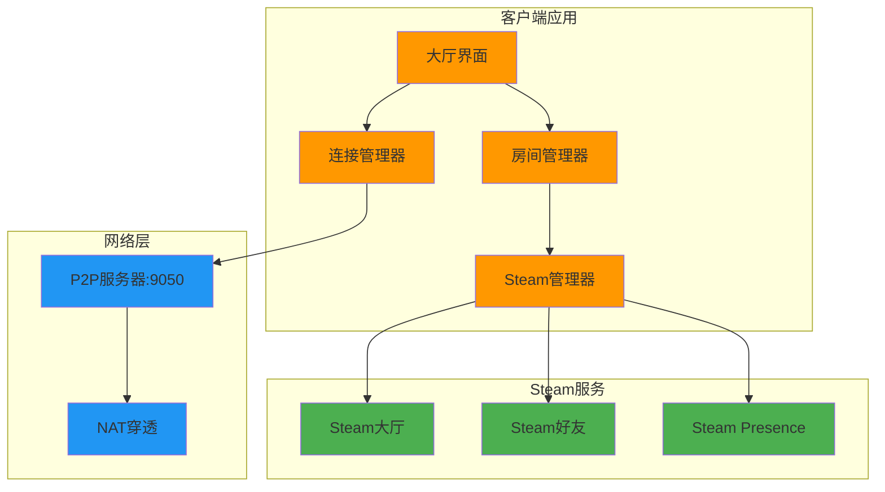

# 设计文档

## 概述

Steam P2P 联机系统是一个综合的多人游戏大厅解决方案，支持多种连接方式和房间管理功能。系统采用混合架构，结合 Steam 的大厅服务和自定义 P2P 网络，为玩家提供灵活的联机体验。

## 架构

### 系统架构图



### 核心组件

#### 1. 大厅界面 (Lobby Interface)

-   **职责**: 替代原有联机界面，提供统一的 Steam P2P 联机入口
-   **功能**: 房间创建、房间列表浏览、直连功能

### UI 设计布局

```
┌─────────────────────────────────────────────────────────────┐
│                    Steam P2P 联机大厅                    ✕  │
├─────────────────────────────────────────────────────────────┤
│                                                             │
│  ┌─────────────────────────────────────────────────────┐    │
│  │                  创建房间                            │    │
│  │                                                     │    │
│  │  房间名称: [_________________________]              │    │
│  │                                                     │    │
│  │                [创建房间]                            │    │
│  │                                                     │    │
│  │  注: Steam房间创建需要时间，请耐心等待...             │    │
│  └─────────────────────────────────────────────────────┘    │
│                                                             │
│  ┌─────────────────────────────────────────────────────┐    │
│  │                  房间列表                            │    │
│  │                                                     │    │
│  │  搜索房间: [___________________] [搜索]              │    │
│  │                                                     │    │
│  │  ┌─────────────────────────────────────────────┐    │    │
│  │  │ 房间名称1        [2/4人]    [加入房间]      │    │    │
│  │  └─────────────────────────────────────────────┘    │    │
│  │  ┌─────────────────────────────────────────────┐    │    │
│  │  │ 房间名称2        [1/4人]    [加入房间]      │    │    │
│  │  └─────────────────────────────────────────────┘    │    │
│  │  ┌─────────────────────────────────────────────┐    │    │
│  │  │ 房间名称3        [3/4人]    [加入房间]      │    │    │
│  │  └─────────────────────────────────────────────┘    │    │
│  └─────────────────────────────────────────────────────┘    │
│                                                             │
│  ┌─────────────────────────────────────────────────────┐    │
│  │                   直连                              │    │
│  │                                                     │    │
│  │  IP地址: [_______________] 端口: [_____]             │    │
│  │                                                     │    │
│  │                [直接连接]                            │    │
│  └─────────────────────────────────────────────────────┘    │
│                                                             │
│                            [返回主菜单]                      │
└─────────────────────────────────────────────────────────────┘
```

### 房间内界面布局

```
┌─────────────────────────────────────────────────────────────┐
│  ← 房间名称: 我的游戏房间                                ✕  │
├─────────────────────────────────────────────────────────────┤
│                                                             │
│  房间可见性: [公开] [好友] [邀请]                            │
│                                                             │
│  房间密码: [___________________]  (留空为无密码)             │
│                                                             │
│  ┌─────────────────────────────────────────────────────┐    │
│  │                  玩家列表                            │    │
│  │                                                     │    │
│  │  ┌─────────────────────────────────────────────┐    │    │
│  │  │ 👑 玩家1 (房主)    延迟: 25ms    [踢出]     │    │    │
│  │  └─────────────────────────────────────────────┘    │    │
│  │  ┌─────────────────────────────────────────────┐    │    │
│  │  │    玩家2          延迟: 45ms    [踢出]     │    │    │
│  │  └─────────────────────────────────────────────┘    │    │
│  │  ┌─────────────────────────────────────────────┐    │    │
│  │  │    玩家3          延迟: 32ms    [踢出]     │    │    │
│  │  └─────────────────────────────────────────────┘    │    │
│  │  ┌─────────────────────────────────────────────┐    │    │
│  │  │    等待玩家加入...                          │    │    │
│  │  └─────────────────────────────────────────────┘    │    │
│  └─────────────────────────────────────────────────────┘    │
│                                                             │
│                        [邀请好友]                           │
└─────────────────────────────────────────────────────────────┘
```

### UI 设计说明

**标题栏:**

-   右上角关闭按钮 (✕) 用于隐藏覆盖层 UI
-   居中显示"Steam P2P 联机大厅"标题

**顶部 - 创建房间区域:**

-   简洁的房间名称输入框
-   单个"创建房间"按钮
-   提示信息说明 Steam 房间创建需要时间
-   避免一开始就提供过多选项，保持界面简洁

**中部 - 房间列表区域:**

-   搜索框用于按房间名称筛选房间
-   搜索按钮：输入内容时进行搜索，不输入时起刷新作用
-   显示可用的 Steam 房间
-   每个房间条目显示：房间名称、当前人数/最大人数、加入按钮
-   列表支持滚动显示更多房间

**底部 - 直连区域:**

-   IP 地址和端口输入框
-   直接连接按钮
-   为高级用户提供传统 P2P 连接方式

**界面特点:**

-   替代原有的联机界面，成为唯一的联机入口
-   界面布局清晰，功能分区明确
-   优先显示 Steam 房间功能，直连作为备选
-   简化初始选项，进入房间后再提供详细设置

### 房间界面设计说明

**顶部 - 房间标题栏:**

-   左侧返回箭头 (←) 用于关闭房间并返回首页
-   右上角关闭按钮 (✕) 用于隐藏覆盖层 UI
-   显示当前房间名称
-   简洁的标题栏设计

**房间设置区域:**

-   可见性切换按钮：公开/好友/邀请，点击切换状态
-   密码输入框：留空时表示无密码，有内容时设置密码
-   只有房主可以修改这些设置

**玩家列表区域:**

-   显示所有已加入的玩家
-   房主显示皇冠图标 (👑)
-   每个玩家显示：名称、延迟、踢出按钮
-   空位显示"等待玩家加入..."
-   只有房主可以踢出其他玩家

**底部操作区域:**

-   邀请好友按钮：打开 Steam 覆盖层进行好友邀请

**权限控制:**

-   房主：可以修改所有设置、踢出玩家、邀请好友
-   普通玩家：只能查看信息和邀请好友，其他控件不可操作

**游戏开始:**

-   游戏开始操作在游戏内进行，不在覆盖层 UI 中处理

#### 2. 连接管理器 (Connection Manager)

-   **职责**: 网络连接建立和维护
-   **功能**: P2P 连接、Steam 大厅连接、连接状态监控

#### 3. 房间管理器 (Room Manager)

-   **职责**: 房间状态和玩家管理
-   **功能**: 房间创建、玩家加入/离开、设置同步

#### 4. Steam 管理器 (Steam Manager)

-   **职责**: Steam API 集成
-   **功能**: 大厅操作、好友管理、Rich Presence

## 组件和接口

### 大厅界面组件

```typescript
interface LobbyInterface {
    // 房间创建
    showRoomNameInput(): void;
    createRoom(roomName: string): Promise<void>;
    showCreatingRoomStatus(): void;

    // 房间列表
    displayRoomList(rooms: PublicRoom[]): void;
    searchRooms(searchTerm: string): Promise<void>;
    refreshRoomList(): void;
    joinRoom(roomId: string): Promise<void>;

    // 直连功能
    showDirectConnectInputs(): void;
    connectDirect(ip: string, port: number): Promise<void>;

    // 状态显示
    showConnectionStatus(status: string): void;
    showErrorMessage(message: string): void;

    // 导航
    returnToMainMenu(): void;
    hideOverlay(): void;
}

interface RoomInterface {
    // 房间信息显示
    displayRoomName(name: string): void;
    showBackButton(): void;

    // 房间设置 (仅房主可操作)
    showVisibilityButtons(current: RoomVisibility): void;
    setVisibility(visibility: RoomVisibility): void;
    showPasswordInput(currentPassword?: string): void;
    setPassword(password: string): void;

    // 玩家管理
    displayPlayerList(players: Player[]): void;
    showPlayerLatency(playerId: string, latency: number): void;
    showKickButton(playerId: string, canKick: boolean): void;
    kickPlayer(playerId: string): void;

    // 房间操作
    showInviteFriendsButton(): void;
    inviteFriends(): void;

    // 权限控制
    setHostPermissions(isHost: boolean): void;

    // 导航
    leaveRoom(): void;
    hideOverlay(): void;
}

enum RoomVisibility {
    PUBLIC = "public",
    FRIENDS = "friends",
    INVITE_ONLY = "invite-only",
}
```

## 数据模型

### 房间相关模型

```typescript
interface Room {
    id: string;
    name: string;
    hostId: string;
    players: Player[];
    settings: RoomSettings;
    state: RoomState;
    createdAt: Date;
}

interface RoomSettings {
    name: string;
    maxPlayers: number;
    map: string;
    gameMode: string;
    password?: string;
    visibility: RoomVisibility;
    allowMidGameJoin: boolean;
    p2pPort: number;
    enableUPnP: boolean;
}

interface RoomInfo {
    id: string;
    name: string;
    hostName: string;
    currentPlayers: number;
    maxPlayers: number;
    map: string;
    gameMode: string;
    hasPassword: boolean;
    visibility: string;
}

enum RoomState {
    WAITING = "waiting",
    STARTING = "starting",
    IN_GAME = "in-game",
    FINISHED = "finished",
}
```

### 玩家相关模型

```typescript
interface Player {
    id: string;
    steamId: string;
    name: string;
    isHost: boolean;
    connectionStatus: ConnectionStatus;
    latency: number;
    joinedAt: Date;
}

interface Friend {
    steamId: string;
    name: string;
    status: FriendStatus;
    gameInfo?: string;
}

enum FriendStatus {
    OFFLINE = "offline",
    ONLINE = "online",
    IN_GAME = "in-game",
    AWAY = "away",
}
```

### 连接相关模型

```typescript
interface Connection {
    id: string;
    type: ConnectionType;
    status: ConnectionStatus;
    latency: number;
    establishedAt: Date;
}

enum ConnectionType {
    STEAM_LOBBY = "steam-lobby",
    DIRECT_P2P = "direct-p2p",
    FRIEND_INVITE = "friend-invite",
}

enum ConnectionStatus {
    CONNECTING = "connecting",
    CONNECTED = "connected",
    DISCONNECTED = "disconnected",
    FAILED = "failed",
}
```

## 错误处理

### 连接错误处理

```typescript
enum ConnectionError {
    NETWORK_UNREACHABLE = "network-unreachable",
    PORT_BLOCKED = "port-blocked",
    STEAM_UNAVAILABLE = "steam-unavailable",
    LOBBY_FULL = "lobby-full",
    INVALID_PASSWORD = "invalid-password",
    KICKED_FROM_ROOM = "kicked-from-room",
    HOST_DISCONNECTED = "host-disconnected",
}

interface ErrorHandler {
    handleConnectionError(error: ConnectionError): void;
    handleSteamError(error: SteamError): void;
    handleP2PError(error: P2PError): void;
    showUserFriendlyMessage(error: Error): void;
}
```

### 错误恢复策略

1. **连接失败**: 自动重试机制，最多 3 次
2. **房主断线**: 自动转移房主权限
3. **Steam 服务不可用**: 降级到纯 P2P 模式
4. **端口被占用**: 自动尝试其他端口
5. **网络中断**: 显示重连选项

## 测试策略

### 单元测试

-   **连接管理器测试**: P2P 连接建立、Steam API 调用
-   **房间管理器测试**: 房间状态管理、玩家操作
-   **数据模型测试**: 序列化/反序列化、验证逻辑

### 集成测试

-   **Steam 集成测试**: 大厅创建/加入、好友邀请
-   **P2P 网络测试**: 不同网络环境下的连接
-   **界面集成测试**: 用户操作流程

### 网络测试

-   **NAT 穿透测试**: 不同 NAT 类型的连接测试
-   **延迟测试**: 高延迟环境下的用户体验
-   **断线重连测试**: 网络中断后的恢复能力

### 用户体验测试

-   **界面响应测试**: 操作响应时间
-   **错误提示测试**: 用户友好的错误信息
-   **多人协作测试**: 同时操作的冲突处理

## 性能考虑

### 网络优化

-   **连接池管理**: 复用 P2P 连接
-   **数据压缩**: 房间状态同步数据压缩
-   **心跳机制**: 定期检测连接状态
-   **带宽控制**: 限制非关键数据传输

### 内存优化

-   **对象池**: 复用频繁创建的对象
-   **事件清理**: 及时移除事件监听器
-   **缓存管理**: 合理的数据缓存策略

### UI 性能

-   **虚拟列表**: 大量房间/好友列表的优化
-   **防抖处理**: 频繁操作的防抖
-   **异步加载**: 非关键 UI 元素的延迟加载

## 安全考虑

### 数据验证

-   **输入验证**: 房间名称、密码等用户输入
-   **权限检查**: 房主操作权限验证
-   **数据完整性**: 网络传输数据的校验

### 网络安全

-   **Steam 身份验证**: 利用 Steam 的身份验证机制
-   **加密传输**: 敏感数据的加密传输
-   **防作弊**: 基本的反作弊检测

### 隐私保护

-   **好友信息**: 仅显示必要的好友信息
-   **房间隐私**: 私有房间的访问控制
-   **数据最小化**: 只传输必要的数据
