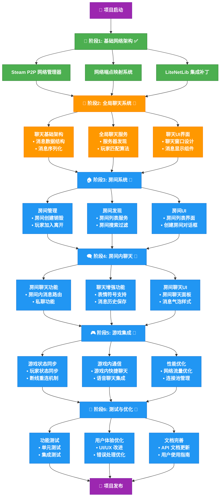

# 逃离鸭堡联机模组开发路线图

## 项目概述
基于Steam P2P网络实现的"逃离鸭堡"多人联机模组，支持全局聊天撮合和房间内通信功能。

## 🎯 核心目标
- 实现Steam P2P网络层集成
- 构建全局聊天系统用于玩家撮合
- 开发房间内聊天通信
- 提供完整的多人游戏体验

## 📈 开发路线图



---

## 📋 开发阶段

### 阶段 1: 基础网络架构 ✅
**状态**: 已完成
**时间估计**: 已完成

- [x] Steam P2P 网络管理器实现
- [x] 网络端点映射系统
- [x] LiteNetLib 集成补丁
- [x] Socket 层 Steam 适配
- [x] 基础网络通信协议

**关键文件**:
- `EscapeFromDuckovCoopMod/Net/Steam/SteamP2PManager.cs`
- `EscapeFromDuckovCoopMod/Net/Steam/SteamEndPointMapper.cs`
- `EscapeFromDuckovCoopMod/Patch/SteamP2P/`

### 阶段 2: 全局聊天系统 🚧
**状态**: 进行中
**时间估计**: 2-3 周

#### 2.1 聊天基础架构
- [ ] 聊天消息数据结构设计
- [ ] 消息序列化/反序列化
- [ ] 聊天历史管理
- [ ] 消息过滤和验证

#### 2.2 全局聊天服务
- [ ] 全局聊天服务器发现
- [ ] 玩家在线状态管理
- [ ] 消息广播机制
- [ ] 玩家匹配算法

#### 2.3 聊天UI界面
- [ ] 全局聊天窗口设计
- [ ] 消息显示组件
- [ ] 输入框和发送功能
- [ ] 玩家列表显示

**预期交付物**:
```
EscapeFromDuckovCoopMod/
├── Chat/
│   ├── GlobalChat/
│   │   ├── GlobalChatManager.cs
│   │   ├── GlobalChatService.cs
│   │   └── PlayerMatchmaking.cs
│   ├── Data/
│   │   ├── ChatMessage.cs
│   │   └── ChatHistory.cs
│   └── UI/
│       ├── GlobalChatWindow.cs
│       └── ChatMessageComponent.cs
```

### 阶段 3: 房间系统 📅
**状态**: 计划中
**时间估计**: 2-3 周

#### 3.1 房间管理
- [ ] 房间创建和销毁
- [ ] 房间信息同步
- [ ] 玩家加入/离开处理
- [ ] 房主权限管理

#### 3.2 房间发现
- [ ] 房间列表服务
- [ ] 房间搜索和过滤
- [ ] 房间状态更新
- [ ] 快速加入功能

#### 3.3 房间UI
- [ ] 房间列表界面
- [ ] 房间创建对话框
- [ ] 房间详情显示
- [ ] 加入房间流程

**预期交付物**:
```
EscapeFromDuckovCoopMod/
├── Lobby/
│   ├── Room/
│   │   ├── RoomManager.cs
│   │   ├── RoomInfo.cs
│   │   └── RoomService.cs
│   ├── Discovery/
│   │   ├── RoomDiscovery.cs
│   │   └── RoomBrowser.cs
│   └── UI/
│       ├── LobbyWindow.cs
│       ├── RoomListComponent.cs
│       └── CreateRoomDialog.cs
```

### 阶段 4: 房间内聊天 📅
**状态**: 计划中
**时间估计**: 1-2 周

#### 4.1 房间聊天功能
- [ ] 房间内消息路由
- [ ] 私聊功能
- [ ] 系统消息通知
- [ ] 聊天命令支持

#### 4.2 聊天增强功能
- [ ] 表情符号支持
- [ ] 消息历史保存
- [ ] 聊天记录导出
- [ ] 消息时间戳

#### 4.3 房间聊天UI
- [ ] 房间聊天面板
- [ ] 消息气泡样式
- [ ] 快捷回复功能
- [ ] 聊天设置选项

**预期交付物**:
```
EscapeFromDuckovCoopMod/
├── Chat/
│   ├── RoomChat/
│   │   ├── RoomChatManager.cs
│   │   ├── PrivateMessage.cs
│   │   └── ChatCommands.cs
│   └── UI/
│       ├── RoomChatPanel.cs
│       └── ChatBubble.cs
```

### 阶段 5: 游戏集成 📅
**状态**: 计划中
**时间估计**: 2-3 周

#### 5.1 游戏状态同步
- [ ] 玩家状态同步
- [ ] 游戏进度同步
- [ ] 场景切换处理
- [ ] 断线重连机制

#### 5.2 游戏内通信
- [ ] 游戏内快捷聊天
- [ ] 语音聊天集成
- [ ] 游戏事件通知
- [ ] 协作功能支持

#### 5.3 性能优化
- [ ] 网络流量优化
- [ ] 消息压缩
- [ ] 连接池管理
- [ ] 内存使用优化

### 阶段 6: 测试与优化 📅
**状态**: 计划中
**时间估计**: 2 周

#### 6.1 功能测试
- [ ] 单元测试编写
- [ ] 集成测试
- [ ] 压力测试
- [ ] 兼容性测试

#### 6.2 用户体验优化
- [ ] UI/UX 改进
- [ ] 错误处理优化
- [ ] 用户反馈收集
- [ ] 性能监控

#### 6.3 文档完善
- [ ] API 文档更新
- [ ] 用户使用指南
- [ ] 开发者文档
- [ ] 部署指南

---

## 🔧 技术架构

### 网络层架构
```
Steam P2P Network
├── SteamP2PManager (核心管理)
├── SteamEndPointMapper (端点映射)
├── LiteNetLib Integration (网络库集成)
└── Message Routing (消息路由)
```

### 聊天系统架构
```
Chat System
├── Global Chat (全局聊天)
│   ├── Player Discovery (玩家发现)
│   ├── Matchmaking (撮合系统)
│   └── Broadcast Messages (广播消息)
├── Room Chat (房间聊天)
│   ├── Room-specific Messages (房间消息)
│   ├── Private Messages (私聊)
│   └── System Notifications (系统通知)
└── UI Components (界面组件)
    ├── Chat Windows (聊天窗口)
    ├── Message Display (消息显示)
    └── Input Controls (输入控件)
```

### 数据流架构
```
User Input → UI Layer → Chat Manager → Network Layer → Steam P2P → Remote Clients
                                    ↓
                              Message Processing
                                    ↓
                              Game Integration
```

---

## 📊 里程碑时间线

| 里程碑 | 预计完成时间 | 关键交付物 |
|--------|-------------|-----------|
| M1: 网络基础 | ✅ 已完成 | Steam P2P 集成 |
| M2: 全局聊天 | 第 4 周 | 玩家撮合功能 |
| M3: 房间系统 | 第 7 周 | 房间创建和管理 |
| M4: 房间聊天 | 第 9 周 | 完整聊天体验 |
| M5: 游戏集成 | 第 12 周 | 完整多人游戏 |
| M6: 发布准备 | 第 14 周 | 稳定版本发布 |

---

## 🎮 功能特性

### 全局聊天功能
- ✨ 实时玩家发现和撮合
- 🌐 跨房间全局消息广播
- 👥 在线玩家列表显示
- 🔍 玩家搜索和过滤
- 📱 现代化聊天界面

### 房间聊天功能
- 💬 房间内实时聊天
- 🔒 私聊消息支持
- 📢 系统通知消息
- 🎭 表情符号支持
- 📝 聊天历史记录

### 技术特性
- 🚀 基于 Steam P2P 的高性能网络
- 🔄 自动断线重连
- 📊 网络状态监控
- 🛡️ 消息验证和过滤
- 🎯 低延迟通信

---

## 🚀 快速开始

### 编译项目
```bash
./build.bat
```

### 运行调试
```bash
./debug.bat
```

### 环境配置
```bash
./SetEnvVars_Permanent.bat
```

---

## 📚 相关文档

- [API 参考文档](codeAnalysis/duckovAPI/)
- [Steam P2P 集成指南](.kiro/specs/steam-p2p-lobby/)
- [本地化支持](Localization/)
- [许可证信息](LICENSE.txt)

---

**最后更新**: 2025年11月2日
**项目状态**: 积极开发中
**当前版本**: v0.2.0-alpha