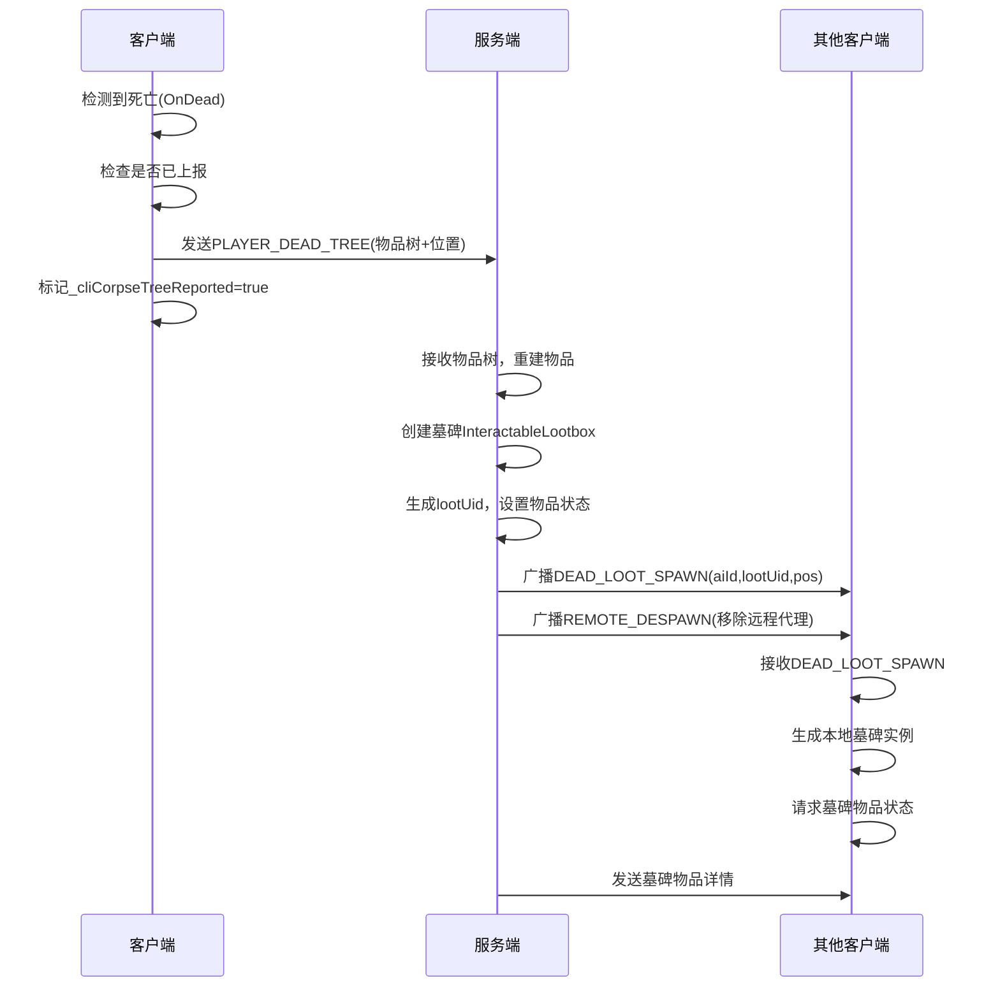
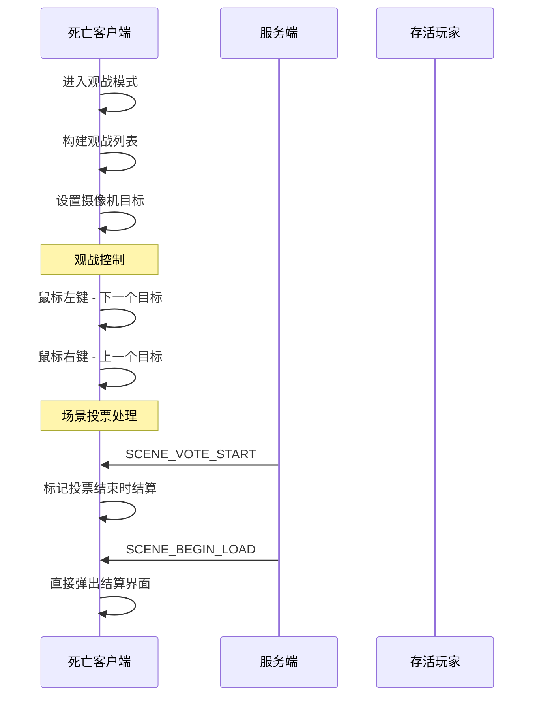

# 玩家死亡系统完整流程分析

## 概览

逃离鸭科夫联机模组的玩家死亡系统是一个基于物品树上报和墓碑同步的网络化死亡处理机制。该系统通过 Harmony 补丁和网络消息协调工作，确保多人游戏中的死亡体验既符合游戏逻辑又保持网络一致性。

## 死亡系统架构

### 核心组件

-   **死亡检测系统**: 检测玩家死亡并触发相应流程
-   **物品树上报**: 客户端向服务端上报死亡时的完整装备树
-   **墓碑管理**: 服务端创建墓碑并同步给所有客户端
-   **观战系统**: 死亡后观看其他玩家游戏
-   **网络同步**: 确保死亡状态在所有客户端同步

### 关键文件

-   `CharacterMainControlPatch.cs`: 死亡检测和上报补丁
-   `SendLocalPlayerStatus.cs`: 死亡状态和物品树上报
-   `DeadLootBox.cs`: 墓碑管理和同步
-   `LocalPlayerManager.cs`: 本地玩家状态管理
-   `Spectator.cs`: 观战系统
-   `Mod.cs`: 网络消息处理

## 死亡流程详细分析

### 1. 死亡检测和上报阶段

#### 1.1 死亡检测补丁

**补丁**: `Patch_Client_OnDead_ReportCorpseTree`

```csharp
[HarmonyPatch(typeof(CharacterMainControl), "OnDead")]
internal static class Patch_Client_OnDead_ReportCorpseTree
{
    private static void Postfix(CharacterMainControl __instance)
    {
        var mod = ModBehaviourF.Instance;
        if (mod == null || !mod.networkStarted) return;

        // 仅"客户端 + 本机玩家"分支上报
        if (mod.IsServer) return;
        if (__instance != CharacterMainControl.Main) return;

        // 已经上报过，直接跳过
        if (LocalPlayerManager.Instance._cliCorpseTreeReported) return;

        try
        {
            // 设置死亡路径标记，避免本地重复生成墓碑
            DeadLootSpawnContext.InOnDead = __instance;

            // 上报整棵装备树给主机
            SendLocalPlayerStatus.Instance.Net_ReportPlayerDeadTree(__instance);

            // 标记已上报
            LocalPlayerManager.Instance._cliCorpseTreeReported = true;
        }
        finally
        {
            DeadLootSpawnContext.InOnDead = null;
        }
    }
}
```

#### 1.2 服务端死亡处理

**补丁**: `Patch_Server_OnDead_Host_UsePlayerTree`

```csharp
[HarmonyPatch(typeof(CharacterMainControl), "OnDead")]
internal static class Patch_Server_OnDead_Host_UsePlayerTree
{
    private static void Postfix(CharacterMainControl __instance)
    {
        var mod = ModBehaviourF.Instance;
        if (mod == null || !mod.networkStarted || !mod.IsServer) return;

        var lm = LevelManager.Instance;
        if (lm == null || __instance != lm.MainCharacter) return;

        // 主机自己死亡时，走相同的树路径
        COOPManager.Host_Handle.Server_HandleHostDeathViaTree(__instance);
    }
}
```

### 2. 物品树上报系统

#### 2.1 客户端物品树上报

**类**: `SendLocalPlayerStatus.cs`

```csharp
public void Net_ReportPlayerDeadTree(CharacterMainControl who)
{
    // 仅客户端上报
    if (!networkStarted || IsServer || connectedPeer == null || who == null)
        return;

    var item = who.CharacterItem;
    if (item == null) return;

    // 获取尸体位置和朝向
    var pos = who.transform.position;
    var rot = who.characterModel ?
        who.characterModel.transform.rotation :
        who.transform.rotation;

    // 发送死亡树数据包
    writer.Reset();
    writer.Put((byte)Op.PLAYER_DEAD_TREE);
    writer.PutV3cm(pos);
    writer.PutQuaternion(rot);

    // 序列化整棵物品树
    ItemTool.WriteItemSnapshot(writer, item);

    connectedPeer.Send(writer, DeliveryMethod.ReliableOrdered);
}
```

#### 2.2 服务端处理死亡树

**类**: `Mod.cs` - PLAYER_DEAD_TREE 消息处理

```csharp
case Op.PLAYER_DEAD_TREE:
{
    if (!IsServer) break;
    var pos = reader.GetV3cm();
    var rot = reader.GetQuaternion();

    var snap = ItemTool.ReadItemSnapshot(reader);
    var tmpRoot = ItemTool.BuildItemFromSnapshot(snap);
    if (!tmpRoot)
    {
        Debug.LogWarning("[LOOT] PLAYER_DEAD_TREE BuildItemFromSnapshot failed.");
        break;
    }

    // 创建墓碑
    var deadPfb = LootManager.Instance.ResolveDeadLootPrefabOnServer();
    var box = InteractableLootbox.CreateFromItem(tmpRoot, pos + Vector3.up * 0.10f, rot, true, deadPfb);
    if (box)
        DeadLootBox.Instance.Server_OnDeadLootboxSpawned(box, null);

    // 清理远程角色代理
    if (remoteCharacters.TryGetValue(peer, out var proxy) && proxy)
    {
        Destroy(proxy);
        remoteCharacters.Remove(peer);
    }

    // 广播远程角色销毁
    if (playerStatuses.TryGetValue(peer, out var st) && !string.IsNullOrEmpty(st.EndPoint))
    {
        var w2 = writer;
        w2.Reset();
        w2.Put((byte)Op.REMOTE_DESPAWN);
        w2.Put(st.EndPoint);
        netManager.SendToAll(w2, DeliveryMethod.ReliableOrdered);
    }

    if (tmpRoot && tmpRoot.gameObject) Destroy(tmpRoot.gameObject);
    break;
}
```

### 3. 观战系统

#### 3.1 观战触发

**类**: `Spectator.cs`

```csharp
public bool TryEnterSpectatorOnDeath(DamageInfo dmgInfo)
{
    var main = CharacterMainControl.Main;
    if (!LevelManager.LevelInited || main == null) return false;

    // 构建可观战的玩家列表
    BuildSpectateList(main);

    if (_spectateList.Count <= 0)
        return false; // 没人可观战，让结算继续

    // 启动观战模式
    _lastDeathInfo = dmgInfo;
    _spectatorActive = true;
    _spectateIdx = 0;

    // 设置摄像机目标
    if (GameCamera.Instance)
        GameCamera.Instance.SetTarget(_spectateList[_spectateIdx]);

    // 如果正在场景投票，标记投票结束时结算
    if (SceneNet.Instance.sceneVoteActive)
        _spectatorEndOnVotePending = true;

    return true; // 拦截结算，启用观战
}
```

#### 3.2 观战列表构建

```csharp
public void BuildSpectateList(CharacterMainControl exclude)
{
    _spectateList.Clear();

    // 获取当前场景ID
    var mySceneId = localPlayerStatus?.SceneId;
    if (string.IsNullOrEmpty(mySceneId))
        LocalPlayerManager.Instance.ComputeIsInGame(out mySceneId);

    // 根据服务端/客户端模式构建列表
    if (IsServer)
    {
        // 服务端：遍历远程角色
        foreach (var kv in remoteCharacters)
        {
            var cmc = kv.Value?.GetComponent<CharacterMainControl>();
            if (!LocalPlayerManager.Instance.IsAlive(cmc) || cmc == exclude)
                continue;

            // 检查是否在同一场景
            string peerScene = GetPeerSceneId(kv.Key);
            if (AreSameMap(mySceneId, peerScene))
                _spectateList.Add(cmc);
        }
    }
    else
    {
        // 客户端：遍历远程角色
        foreach (var kv in clientRemoteCharacters)
        {
            var cmc = kv.Value?.GetComponent<CharacterMainControl>();
            if (!LocalPlayerManager.Instance.IsAlive(cmc) || cmc == exclude)
                continue;

            // 检查是否在同一场景
            string peerScene = GetClientPeerSceneId(kv.Key);
            if (AreSameMap(mySceneId, peerScene))
                _spectateList.Add(cmc);
        }
    }
}
```

#### 3.3 观战控制

```csharp
// 切换到下一个观战目标
public void SpectateNext()
{
    if (_spectateList.Count == 0) return;
    _spectateIdx = (_spectateIdx + 1) % _spectateList.Count;
    if (GameCamera.Instance)
        GameCamera.Instance.SetTarget(_spectateList[_spectateIdx]);
}

// 切换到上一个观战目标
public void SpectatePrev()
{
    if (_spectateList.Count == 0) return;
    _spectateIdx = (_spectateIdx - 1 + _spectateList.Count) % _spectateList.Count;
    if (GameCamera.Instance)
        GameCamera.Instance.SetTarget(_spectateList[_spectateIdx]);
}

// 结束观战并显示结算界面
public void EndSpectatorAndShowClosure()
{
    _spectatorEndOnVotePending = false;

    if (!_spectatorActive) return;
    _spectatorActive = false;
    _skipSpectatorForNextClosure = true;

    // 显示死亡结算界面
    ShowClosureView(_lastDeathInfo, 0.5f);
}
```

### 4. 墓碑系统

#### 4.1 服务端墓碑创建

**类**: `DeadLootBox.cs`

```csharp
public void Server_OnDeadLootboxSpawned(InteractableLootbox box, CharacterMainControl whoDied)
{
    if (!IsServer || box == null) return;
    try
    {
        // 生成稳定 ID 并登记
        var lootUid = LootManager.Instance._nextLootUid++;
        var inv = box.Inventory;
        if (inv) LootManager.Instance._srvLootByUid[lootUid] = inv;

        var aiId = 0;
        if (whoDied)
        {
            var tag = whoDied.GetComponent<NetAiTag>();
            if (tag != null) aiId = tag.aiId;
            if (aiId == 0)
                foreach (var kv in AITool.aiById)
                    if (kv.Value == whoDied)
                    {
                        aiId = kv.Key;
                        break;
                    }
        }

        // 设置物品检视状态
        if (inv != null)
        {
            inv.NeedInspection = true;
            // 把当前内容全部标记为"未鉴定"
            for (var i = 0; i < inv.Content.Count; ++i)
            {
                var it = inv.GetItemAt(i);
                if (it) it.Inspected = false;
            }
        }

        // 广播墓碑生成消息
        writer.Reset();
        writer.Put((byte)Op.DEAD_LOOT_SPAWN);
        writer.Put(SceneManager.GetActiveScene().buildIndex);
        writer.Put(aiId);
        writer.Put(lootUid);
        writer.PutV3cm(box.transform.position);
        writer.PutQuaternion(box.transform.rotation);
        netManager.SendToAll(writer, DeliveryMethod.ReliableOrdered);
    }
    catch (Exception e)
    {
        Debug.LogError("[LOOT] Server_OnDeadLootboxSpawned failed: " + e);
    }
}
```

#### 4.2 客户端墓碑生成

**类**: `DeadLootBox.cs`

```csharp
public void SpawnDeadLootboxAt(int aiId, int lootUid, Vector3 pos, Quaternion rot)
{
    try
    {
        AITool.TryClientRemoveNearestAICorpse(pos, 3.0f);

        var prefab = GetDeadLootPrefabOnClient(aiId);
        if (!prefab)
        {
            Debug.LogWarning("[LOOT] DeadLoot prefab not found on client, spawn aborted.");
            return;
        }

        var go = Instantiate(prefab, pos, rot);
        var box = go ? go.GetComponent<InteractableLootbox>() : null;
        if (!box) return;

        var inv = box.Inventory;
        if (!inv)
        {
            Debug.LogWarning("[Client DeadLootBox Spawn] Inventory is null!");
            return;
        }

        WorldLootPrime.PrimeIfClient(box);

        // 注册库存映射
        var dict = InteractableLootbox.Inventories;
        if (dict != null)
        {
            var correctKey = LootManager.ComputeLootKeyFromPos(pos);
            dict[correctKey] = inv;
        }

        // 稳定 ID → inv
        if (lootUid >= 0) LootManager.Instance._cliLootByUid[lootUid] = inv;

        // 若快照先到，优先应用缓存
        if (lootUid >= 0 && LootManager.Instance._pendingLootStatesByUid.TryGetValue(lootUid, out var pack))
        {
            LootManager.Instance._pendingLootStatesByUid.Remove(lootUid);
            // 应用缓存的物品状态...
            return;
        }

        // 正常路径：请求状态
        COOPManager.LootNet.Client_RequestLootState(inv);
        StartCoroutine(LootManager.Instance.ClearLootLoadingTimeout(inv, 1.5f));
    }
    catch (Exception e)
    {
        Debug.LogError("[LOOT] SpawnDeadLootboxAt failed: " + e);
    }
}
```

### 5. 网络同步流程

#### 5.1 死亡状态同步



#### 5.2 观战状态同步



### 6. 生命周期管理

#### 6.1 死亡状态标记

```csharp
public class LocalPlayerManager
{
    private bool _cliSelfDeathFired;        // 客户端死亡标记
    internal bool _cliCorpseTreeReported;   // 尸体树上报标记
    internal bool _cliInEnsureSelfDeathEmit; // 死亡事件发送标记

    public bool IsAlive(CharacterMainControl cmc)
    {
        if (!cmc) return false;

        var h = cmc.Health;
        if (!h) return false;

        // 检查血量和死亡状态
        return h.CurrentHealth > 1e-3f && !h.IsDead;
    }
}
```

#### 6.2 复活处理

```csharp
// 当玩家血量恢复时重置死亡标记
if (currentHealth > 1e-3f)
{
    _cliSelfDeathFired = false;
    _cliCorpseTreeReported = false;
    _cliInEnsureSelfDeathEmit = false;
}
```

### 7. 特殊情况处理

#### 7.1 场景切换中的死亡

```csharp
// 观战中收到场景投票
case Op.SCENE_VOTE_START:
    if (Spectator.Instance._spectatorActive)
        Spectator.Instance._spectatorEndOnVotePending = true;
    break;

// 观战中的场景切换
case Op.SCENE_BEGIN_LOAD:
    if (Spectator.Instance._spectatorActive &&
        Spectator.Instance._spectatorEndOnVotePending)
    {
        // 直接弹出结算，不参与场景切换
        Spectator.Instance.EndSpectatorAndShowClosure();
        break;
    }
    break;
```

#### 7.2 全员死亡处理

```csharp
// 检查是否所有玩家都已死亡
public static bool AllPlayersDead()
{
    var alive = 0;

    // 检查本地玩家
    if (LocalPlayerManager.Instance.IsAlive(CharacterMainControl.Main))
        alive++;

    // 检查远程玩家
    foreach (var player in GetAllRemotePlayers())
    {
        if (LocalPlayerManager.Instance.IsAlive(player))
            alive++;
    }

    return alive == 0;
}

// 观战系统中的全员死亡检测
if (_spectateList.Count == 0 || SceneM.AllPlayersDead())
{
    Spectator.Instance.EndSpectatorAndShowClosure();
    return;
}
```

### 8. 调试和监控

#### 8.1 调试日志

```csharp
// 死亡检测日志
Debug.Log("[DEATH-DEBUG] Patch_Client_OnDead_ReportCorpseTree called");
Debug.Log("[DEATH-DEBUG] _cliCorpseTreeReported: false");
Debug.Log("[DEATH-DEBUG] Reporting corpse tree to server");

// 物品树上报日志
Debug.Log("[DEATH-DEBUG] Net_ReportPlayerDeadTree called");
Debug.Log("[DEATH-DEBUG] Item snapshot written to packet");
Debug.Log("[DEATH-DEBUG] PLAYER_DEAD_TREE packet sent to server");

// 墓碑系统日志
Debug.Log("[DEATH-DEBUG] Server_OnDeadLootboxSpawned called");
Debug.Log("[DEATH-DEBUG] Broadcasting DEAD_LOOT_SPAWN");
Debug.Log("[DEATH-DEBUG] SpawnDeadLootboxAt called");
```

#### 8.2 本地化支持

```json
{
    "key": "ui.spectator.mode",
    "value": "观战模式：左键 ▶ 下一个 | 右键 ◀ 上一个 | 正在观战"
},
{
    "key": "death.loot.spawned",
    "value": "死亡战利品已生成"
},
{
    "key": "death.corpse.reported",
    "value": "尸体信息已上报服务器"
}
```

## 系统特点和优势

### 1. 物品树同步机制

-   **完整保存**: 通过 ItemSnapshot 完整保存死亡时的装备树
-   **服务端权威**: 服务端负责墓碑创建和物品状态管理
-   **网络优化**: 使用稳定的 lootUid 进行墓碑标识和同步

### 2. 观战体验

-   **无缝切换**: 死亡后可立即进入观战模式
-   **智能筛选**: 只观战同场景的存活玩家
-   **直观控制**: 鼠标左右键切换观战目标

### 3. 网络同步

-   **权威处理**: 服务端权威处理死亡逻辑和墓碑创建
-   **状态同步**: 确保所有客户端墓碑状态一致
-   **容错设计**: 处理各种异常情况和网络延迟

### 4. 状态管理

-   **防重复**: 通过\_cliCorpseTreeReported 防止重复上报
-   **生命周期**: 正确管理死亡标记的设置和重置
-   **场景感知**: 基于场景切换正确处理死亡状态

## 技术创新点

### 1. 物品树序列化

通过 ItemTool.WriteItemSnapshot/ReadItemSnapshot 实现完整的装备树网络传输，确保死亡时装备的完整性。

### 2. 智能观战系统

基于场景 ID 的智能观战列表构建，确保只观战相关的玩家，提供良好的观战体验。

### 3. 稳定 ID 机制

使用 lootUid 为每个墓碑分配稳定的网络标识，支持缓存机制和状态同步。

### 4. 双重防护机制

通过 DeadLootSpawnContext.InOnDead 标记和补丁系统，防止客户端本地重复生成墓碑。

这个死亡系统展现了一个成熟的多人游戏死亡处理机制的完整实现，通过物品树上报和服务端权威的墓碑管理，确保了死亡体验的一致性和可靠性。
