# 逃离鸭科夫联机模组 - 完整架构图

## 1. 整体系统架构

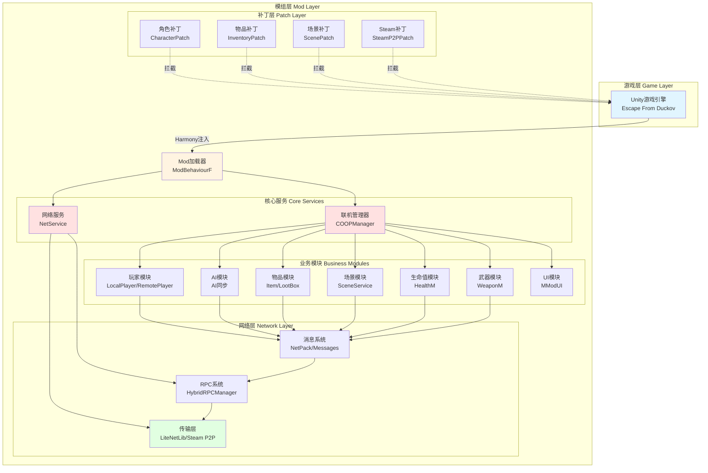
```mermaid
graph TB
    subgraph "游戏层 Game Layer"
        Game[Unity游戏引擎<br/>Escape From Duckov]
    end
    
    subgraph "模组层 Mod Layer"
        Loader[Mod加载器<br/>ModBehaviourF]
        
        subgraph "核心服务 Core Services"
            NetService[网络服务<br/>NetService]
            COOPManager[联机管理器<br/>COOPManager]
        end
        
        subgraph "业务模块 Business Modules"
            Player[玩家模块<br/>LocalPlayer/RemotePlayer]
            AI[AI模块<br/>AI同步]
            Item[物品模块<br/>Item/LootBox]
            Scene[场景模块<br/>SceneService]
            Health[生命值模块<br/>HealthM]
            Weapon[武器模块<br/>WeaponM]
            UI[UI模块<br/>MModUI]
        end
        
        subgraph "网络层 Network Layer"
            Transport[传输层<br/>LiteNetLib/Steam P2P]
            RPC[RPC系统<br/>HybridRPCManager]
            Message[消息系统<br/>NetPack/Messages]
        end
        
        subgraph "补丁层 Patch Layer"
            CharPatch[角色补丁<br/>CharacterPatch]
            ItemPatch[物品补丁<br/>InventoryPatch]
            ScenePatch[场景补丁<br/>ScenePatch]
            SteamPatch[Steam补丁<br/>SteamP2PPatch]
        end
    end
    
    Game -->|Harmony注入| Loader
    Loader --> NetService
    Loader --> COOPManager
    
    NetService --> Transport
    NetService --> RPC
    
    COOPManager --> Player
    COOPManager --> AI
    COOPManager --> Item
    COOPManager --> Scene
    COOPManager --> Health
    COOPManager --> Weapon
    COOPManager --> UI
    
    Player --> Message
    AI --> Message
    Item --> Message
    Scene --> Message
    Health --> Message
    Weapon --> Message
    
    Message --> RPC
    RPC --> Transport
    
    CharPatch -.->|拦截| Game
    ItemPatch -.->|拦截| Game
    ScenePatch -.->|拦截| Game
    SteamPatch -.->|拦截| Game
    
    style Game fill:#e1f5ff
    style Loader fill:#fff4e1
    style NetService fill:#ffe1e1
    style COOPManager fill:#ffe1e1
    style Transport fill:#e1ffe1
```

## 2. 网络通信架构

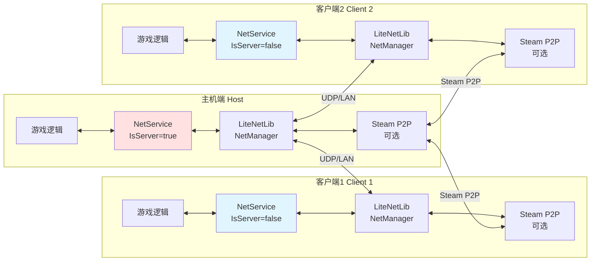
```mermaid
graph LR
    subgraph "主机端 Host"
        H_Game[游戏逻辑]
        H_Service[NetService<br/>IsServer=true]
        H_Manager[LiteNetLib<br/>NetManager]
        H_Steam[Steam P2P<br/>可选]
    end
    
    subgraph "客户端1 Client 1"
        C1_Game[游戏逻辑]
        C1_Service[NetService<br/>IsServer=false]
        C1_Manager[LiteNetLib<br/>NetManager]
        C1_Steam[Steam P2P<br/>可选]
    end
    
    subgraph "客户端2 Client 2"
        C2_Game[游戏逻辑]
        C2_Service[NetService<br/>IsServer=false]
        C2_Manager[LiteNetLib<br/>NetManager]
        C2_Steam[Steam P2P<br/>可选]
    end
    
    H_Game <--> H_Service
    H_Service <--> H_Manager
    H_Manager <--> H_Steam
    
    C1_Game <--> C1_Service
    C1_Service <--> C1_Manager
    C1_Manager <--> C1_Steam
    
    C2_Game <--> C2_Service
    C2_Service <--> C2_Manager
    C2_Manager <--> C2_Steam
    
    H_Manager <-->|UDP/LAN| C1_Manager
    H_Manager <-->|UDP/LAN| C2_Manager
    
    H_Steam <-->|Steam P2P| C1_Steam
    H_Steam <-->|Steam P2P| C2_Steam
    
    style H_Service fill:#ffe1e1
    style C1_Service fill:#e1f5ff
    style C2_Service fill:#e1f5ff
```

## 3. 数据同步流程

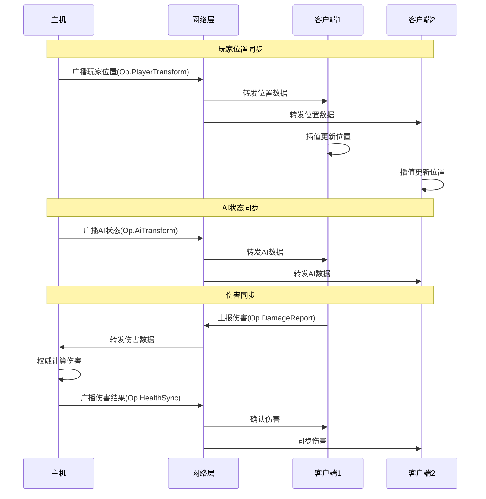
```mermaid
sequenceDiagram
    participant Host as 主机
    participant Net as 网络层
    participant C1 as 客户端1
    participant C2 as 客户端2
    
    Note over Host,C2: 玩家位置同步
    Host->>Net: 广播玩家位置(Op.PlayerTransform)
    Net->>C1: 转发位置数据
    Net->>C2: 转发位置数据
    C1->>C1: 插值更新位置
    C2->>C2: 插值更新位置
    
    Note over Host,C2: AI状态同步
    Host->>Net: 广播AI状态(Op.AiTransform)
    Net->>C1: 转发AI数据
    Net->>C2: 转发AI数据
    
    Note over Host,C2: 伤害同步
    C1->>Net: 上报伤害(Op.DamageReport)
    Net->>Host: 转发伤害数据
    Host->>Host: 权威计算伤害
    Host->>Net: 广播伤害结果(Op.HealthSync)
    Net->>C1: 确认伤害
    Net->>C2: 同步伤害
```

## 4. 模块依赖关系

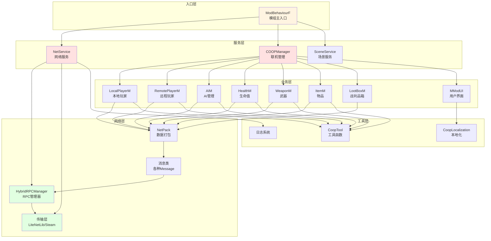
```mermaid
graph TD
    subgraph "入口层"
        Mod[ModBehaviourF<br/>模组主入口]
    end
    
    subgraph "服务层"
        NetService[NetService<br/>网络服务]
        COOPManager[COOPManager<br/>联机管理]
        SceneService[SceneService<br/>场景服务]
    end
    
    subgraph "业务层"
        LocalPlayer[LocalPlayerM<br/>本地玩家]
        RemotePlayer[RemotePlayerM<br/>远程玩家]
        AI[AIM<br/>AI管理]
        Health[HealthM<br/>生命值]
        Weapon[WeaponM<br/>武器]
        Item[ItemM<br/>物品]
        LootBox[LootBoxM<br/>战利品箱]
        UI[MModUI<br/>用户界面]
    end
    
    subgraph "网络层"
        RPC[HybridRPCManager<br/>RPC管理器]
        Transport[传输层<br/>LiteNetLib/Steam]
        NetPack[NetPack<br/>数据打包]
        Messages[消息类<br/>各种Message]
    end
    
    subgraph "工具层"
        Utils[CoopTool<br/>工具函数]
        Localization[CoopLocalization<br/>本地化]
        Logger[日志系统]
    end
    
    Mod --> NetService
    Mod --> COOPManager
    Mod --> SceneService
    
    NetService --> RPC
    NetService --> Transport
    
    COOPManager --> LocalPlayer
    COOPManager --> RemotePlayer
    COOPManager --> AI
    COOPManager --> Health
    COOPManager --> Weapon
    COOPManager --> Item
    COOPManager --> LootBox
    COOPManager --> UI
    
    LocalPlayer --> NetPack
    RemotePlayer --> NetPack
    AI --> NetPack
    Health --> NetPack
    Weapon --> NetPack
    Item --> NetPack
    LootBox --> NetPack
    
    NetPack --> Messages
    Messages --> RPC
    RPC --> Transport
    
    LocalPlayer --> Utils
    RemotePlayer --> Utils
    AI --> Utils
    Health --> Utils
    Weapon --> Utils
    Item --> Utils
    
    UI --> Localization
    NetService --> Logger
    
    style Mod fill:#fff4e1
    style NetService fill:#ffe1e1
    style COOPManager fill:#ffe1e1
    style RPC fill:#e1ffe1
    style Transport fill:#e1ffe1
```

## 5. RPC通信架构

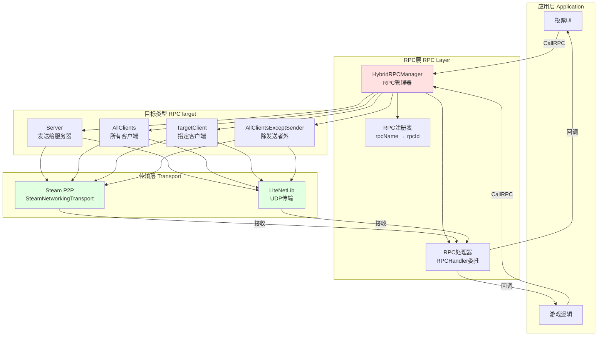
```mermaid
graph TB
    subgraph "应用层 Application"
        VoteUI[投票UI]
        GameLogic[游戏逻辑]
    end
    
    subgraph "RPC层 RPC Layer"
        RPC[HybridRPCManager<br/>RPC管理器]
        Registry[RPC注册表<br/>rpcName → rpcId]
        Handler[RPC处理器<br/>RPCHandler委托]
    end
    
    subgraph "传输层 Transport"
        Steam[Steam P2P<br/>SteamNetworkingTransport]
        LAN[LiteNetLib<br/>UDP传输]
    end
    
    subgraph "目标类型 RPCTarget"
        Server[Server<br/>发送给服务器]
        AllClients[AllClients<br/>所有客户端]
        TargetClient[TargetClient<br/>指定客户端]
        ExceptSender[AllClientsExceptSender<br/>除发送者外]
    end
    
    VoteUI -->|CallRPC| RPC
    GameLogic -->|CallRPC| RPC
    
    RPC --> Registry
    RPC --> Handler
    RPC --> Server
    RPC --> AllClients
    RPC --> TargetClient
    RPC --> ExceptSender
    
    Server --> Steam
    Server --> LAN
    AllClients --> Steam
    AllClients --> LAN
    TargetClient --> Steam
    TargetClient --> LAN
    ExceptSender --> Steam
    ExceptSender --> LAN
    
    Steam -->|接收| Handler
    LAN -->|接收| Handler
    Handler -->|回调| VoteUI
    Handler -->|回调| GameLogic
    
    style RPC fill:#ffe1e1
    style Steam fill:#e1ffe1
    style LAN fill:#e1ffe1
```

## 6. 投票系统流程

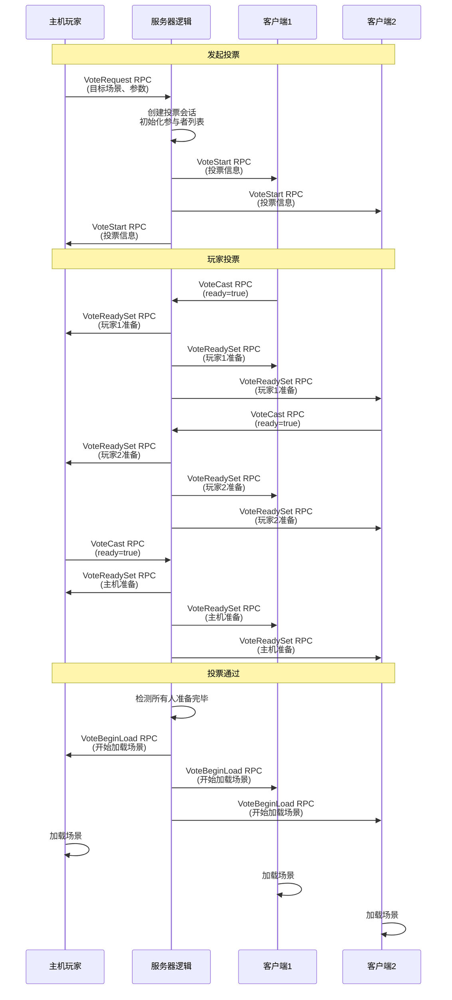
```mermaid
sequenceDiagram
    participant Host as 主机玩家
    participant Server as 服务器逻辑
    participant Client1 as 客户端1
    participant Client2 as 客户端2
    
    Note over Host,Client2: 发起投票
    Host->>Server: VoteRequest RPC<br/>(目标场景、参数)
    Server->>Server: 创建投票会话<br/>初始化参与者列表
    Server->>Client1: VoteStart RPC<br/>(投票信息)
    Server->>Client2: VoteStart RPC<br/>(投票信息)
    Server->>Host: VoteStart RPC<br/>(投票信息)
    
    Note over Host,Client2: 玩家投票
    Client1->>Server: VoteCast RPC<br/>(ready=true)
    Server->>Host: VoteReadySet RPC<br/>(玩家1准备)
    Server->>Client1: VoteReadySet RPC<br/>(玩家1准备)
    Server->>Client2: VoteReadySet RPC<br/>(玩家1准备)
    
    Client2->>Server: VoteCast RPC<br/>(ready=true)
    Server->>Host: VoteReadySet RPC<br/>(玩家2准备)
    Server->>Client1: VoteReadySet RPC<br/>(玩家2准备)
    Server->>Client2: VoteReadySet RPC<br/>(玩家2准备)
    
    Host->>Server: VoteCast RPC<br/>(ready=true)
    Server->>Host: VoteReadySet RPC<br/>(主机准备)
    Server->>Client1: VoteReadySet RPC<br/>(主机准备)
    Server->>Client2: VoteReadySet RPC<br/>(主机准备)
    
    Note over Host,Client2: 投票通过
    Server->>Server: 检测所有人准备完毕
    Server->>Host: VoteBeginLoad RPC<br/>(开始加载场景)
    Server->>Client1: VoteBeginLoad RPC<br/>(开始加载场景)
    Server->>Client2: VoteBeginLoad RPC<br/>(开始加载场景)
    
    Host->>Host: 加载场景
    Client1->>Client1: 加载场景
    Client2->>Client2: 加载场景
```

## 7. 战利品箱同步架构

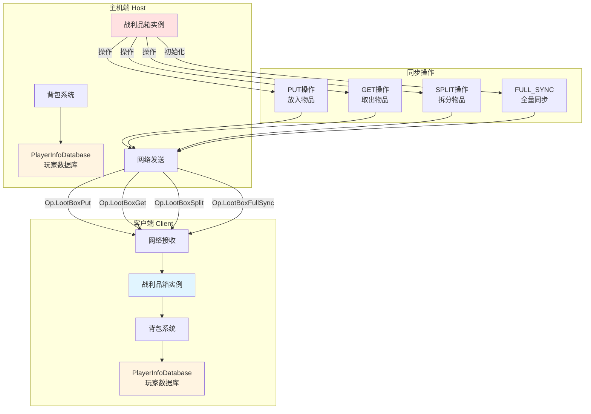
```mermaid
graph TB
    subgraph "主机端 Host"
        H_LootBox[战利品箱实例]
        H_Inventory[背包系统]
        H_Database[PlayerInfoDatabase<br/>玩家数据库]
        H_Net[网络发送]
    end
    
    subgraph "客户端 Client"
        C_LootBox[战利品箱实例]
        C_Inventory[背包系统]
        C_Database[PlayerInfoDatabase<br/>玩家数据库]
        C_Net[网络接收]
    end
    
    subgraph "同步操作"
        PUT[PUT操作<br/>放入物品]
        GET[GET操作<br/>取出物品]
        FULL[FULL_SYNC<br/>全量同步]
        SPLIT[SPLIT操作<br/>拆分物品]
    end
    
    H_LootBox -->|操作| PUT
    H_LootBox -->|操作| GET
    H_LootBox -->|操作| SPLIT
    H_LootBox -->|初始化| FULL
    
    PUT --> H_Net
    GET --> H_Net
    SPLIT --> H_Net
    FULL --> H_Net
    
    H_Net -->|Op.LootBoxPut| C_Net
    H_Net -->|Op.LootBoxGet| C_Net
    H_Net -->|Op.LootBoxSplit| C_Net
    H_Net -->|Op.LootBoxFullSync| C_Net
    
    C_Net --> C_LootBox
    C_LootBox --> C_Inventory
    C_Inventory --> C_Database
    
    H_Inventory --> H_Database
    
    style H_LootBox fill:#ffe1e1
    style C_LootBox fill:#e1f5ff
    style H_Database fill:#fff4e1
    style C_Database fill:#fff4e1
```

## 8. 生命值同步架构

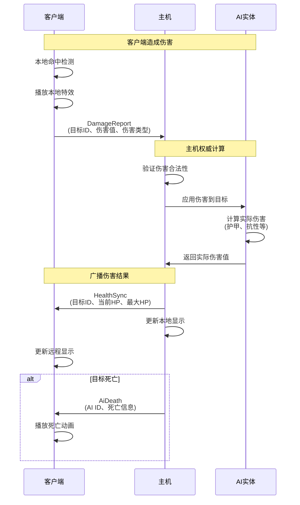
```mermaid
sequenceDiagram
    participant C as 客户端
    participant H as 主机
    participant AI as AI实体
    
    Note over C,AI: 客户端造成伤害
    C->>C: 本地命中检测
    C->>C: 播放本地特效
    C->>H: DamageReport<br/>(目标ID、伤害值、伤害类型)
    
    Note over H,AI: 主机权威计算
    H->>H: 验证伤害合法性
    H->>AI: 应用伤害到目标
    AI->>AI: 计算实际伤害<br/>(护甲、抗性等)
    AI->>H: 返回实际伤害值
    
    Note over H,C: 广播伤害结果
    H->>C: HealthSync<br/>(目标ID、当前HP、最大HP)
    H->>H: 更新本地显示
    C->>C: 更新远程显示
    
    alt 目标死亡
        H->>C: AiDeath<br/>(AI ID、死亡信息)
        C->>C: 播放死亡动画
    end
```

## 9. 补丁系统架构

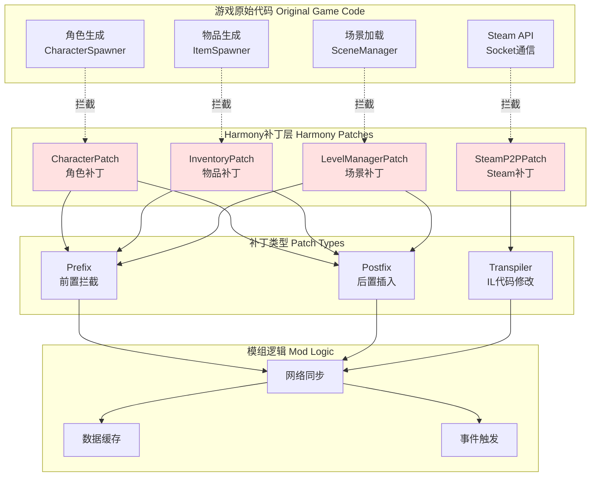
```mermaid
graph TB
    subgraph "游戏原始代码 Original Game Code"
        CharSpawn[角色生成<br/>CharacterSpawner]
        ItemSpawn[物品生成<br/>ItemSpawner]
        SceneLoad[场景加载<br/>SceneManager]
        SteamAPI[Steam API<br/>Socket通信]
    end
    
    subgraph "Harmony补丁层 Harmony Patches"
        CharPatch[CharacterPatch<br/>角色补丁]
        ItemPatch[InventoryPatch<br/>物品补丁]
        ScenePatch[LevelManagerPatch<br/>场景补丁]
        SteamPatch[SteamP2PPatch<br/>Steam补丁]
    end
    
    subgraph "补丁类型 Patch Types"
        Prefix[Prefix<br/>前置拦截]
        Postfix[Postfix<br/>后置插入]
        Transpiler[Transpiler<br/>IL代码修改]
    end
    
    subgraph "模组逻辑 Mod Logic"
        NetSync[网络同步]
        DataCache[数据缓存]
        EventTrigger[事件触发]
    end
    
    CharSpawn -.->|拦截| CharPatch
    ItemSpawn -.->|拦截| ItemPatch
    SceneLoad -.->|拦截| ScenePatch
    SteamAPI -.->|拦截| SteamPatch
    
    CharPatch --> Prefix
    CharPatch --> Postfix
    ItemPatch --> Prefix
    ItemPatch --> Postfix
    ScenePatch --> Prefix
    ScenePatch --> Postfix
    SteamPatch --> Transpiler
    
    Prefix --> NetSync
    Postfix --> NetSync
    Transpiler --> NetSync
    
    NetSync --> DataCache
    NetSync --> EventTrigger
    
    style CharPatch fill:#ffe1e1
    style ItemPatch fill:#ffe1e1
    style ScenePatch fill:#ffe1e1
    style SteamPatch fill:#ffe1e1
```

## 10. 玩家状态机

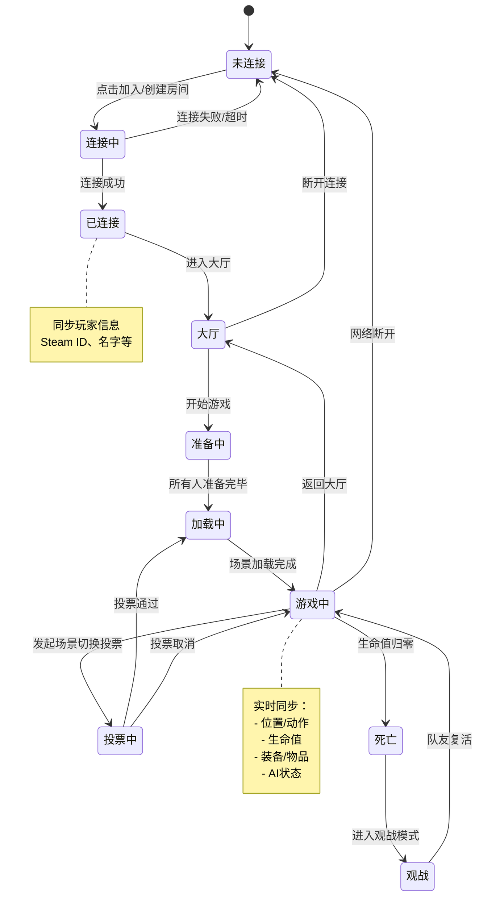
```mermaid
stateDiagram-v2
    [*] --> 未连接
    
    未连接 --> 连接中: 点击加入/创建房间
    连接中 --> 已连接: 连接成功
    连接中 --> 未连接: 连接失败/超时
    
    已连接 --> 大厅: 进入大厅
    大厅 --> 准备中: 开始游戏
    准备中 --> 加载中: 所有人准备完毕
    
    加载中 --> 游戏中: 场景加载完成
    游戏中 --> 投票中: 发起场景切换投票
    投票中 --> 加载中: 投票通过
    投票中 --> 游戏中: 投票取消
    
    游戏中 --> 死亡: 生命值归零
    死亡 --> 观战: 进入观战模式
    观战 --> 游戏中: 队友复活
    
    游戏中 --> 大厅: 返回大厅
    大厅 --> 未连接: 断开连接
    游戏中 --> 未连接: 网络断开
    
    note right of 已连接
        同步玩家信息
        Steam ID、名字等
    end note
    
    note right of 游戏中
        实时同步：
        - 位置/动作
        - 生命值
        - 装备/物品
        - AI状态
    end note
```

## 11. 数据流向图

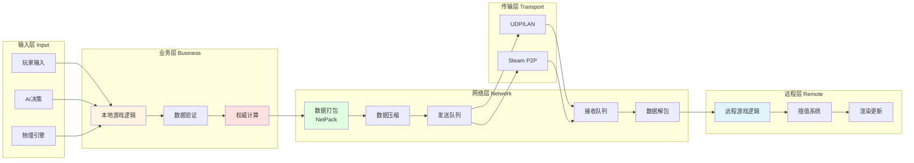
```mermaid
flowchart LR
    subgraph "输入层 Input"
        Player[玩家输入]
        AI[AI决策]
        Physics[物理引擎]
    end
    
    subgraph "业务层 Business"
        LocalLogic[本地游戏逻辑]
        Validation[数据验证]
        Authority[权威计算]
    end
    
    subgraph "网络层 Network"
        Pack[数据打包<br/>NetPack]
        Compress[数据压缩]
        Send[发送队列]
        Receive[接收队列]
        Unpack[数据解包]
    end
    
    subgraph "传输层 Transport"
        UDP[UDP/LAN]
        Steam[Steam P2P]
    end
    
    subgraph "远程层 Remote"
        RemoteLogic[远程游戏逻辑]
        Interpolation[插值系统]
        Render[渲染更新]
    end
    
    Player --> LocalLogic
    AI --> LocalLogic
    Physics --> LocalLogic
    
    LocalLogic --> Validation
    Validation --> Authority
    Authority --> Pack
    
    Pack --> Compress
    Compress --> Send
    Send --> UDP
    Send --> Steam
    
    UDP --> Receive
    Steam --> Receive
    Receive --> Unpack
    Unpack --> RemoteLogic
    
    RemoteLogic --> Interpolation
    Interpolation --> Render
    
    style LocalLogic fill:#fff4e1
    style Authority fill:#ffe1e1
    style Pack fill:#e1ffe1
    style RemoteLogic fill:#e1f5ff
```

## 12. 操作码(Op)分类

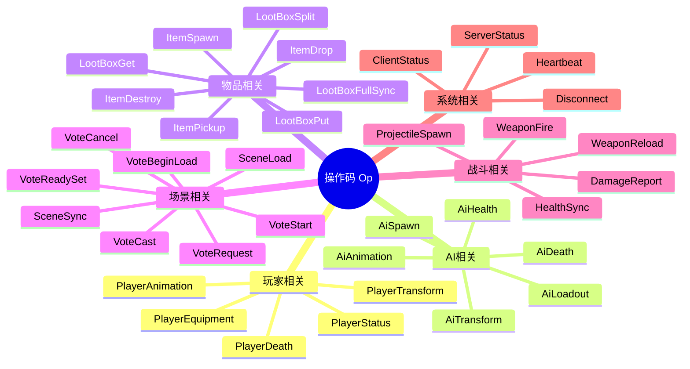
```mermaid
mindmap
  root((操作码 Op))
    玩家相关
      PlayerTransform
      PlayerAnimation
      PlayerEquipment
      PlayerStatus
      PlayerDeath
    AI相关
      AiSpawn
      AiTransform
      AiAnimation
      AiHealth
      AiDeath
      AiLoadout
    物品相关
      ItemSpawn
      ItemPickup
      ItemDrop
      ItemDestroy
      LootBoxPut
      LootBoxGet
      LootBoxSplit
      LootBoxFullSync
    场景相关
      SceneLoad
      SceneSync
      VoteStart
      VoteRequest
      VoteCast
      VoteReadySet
      VoteBeginLoad
      VoteCancel
    战斗相关
      DamageReport
      HealthSync
      WeaponFire
      WeaponReload
      ProjectileSpawn
    系统相关
      Heartbeat
      ClientStatus
      ServerStatus
      Disconnect
```

## 13. 性能优化架构

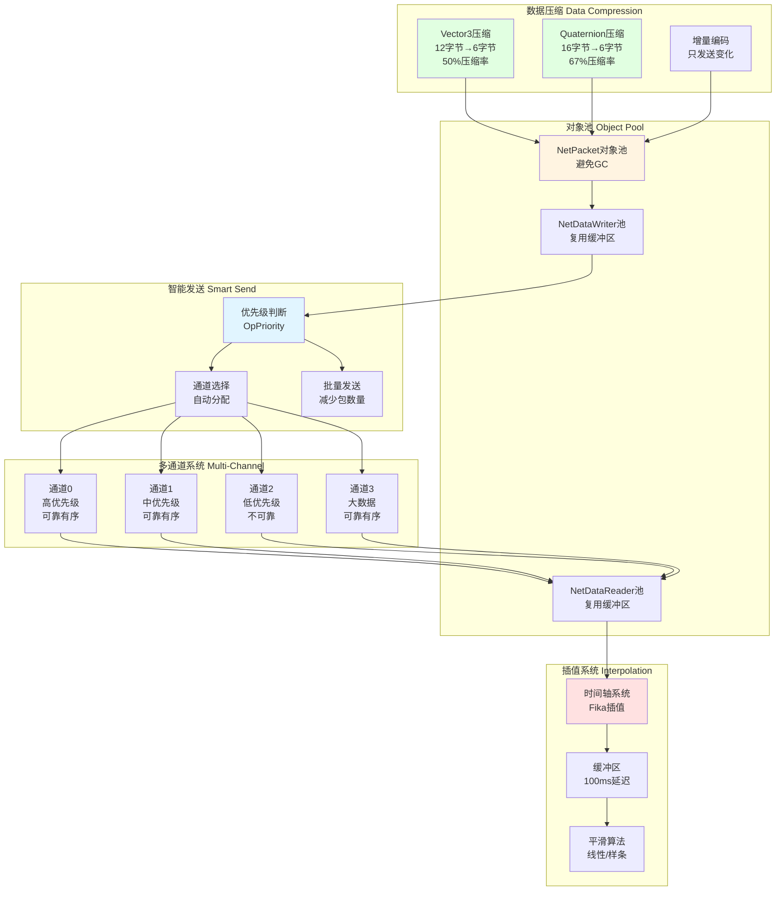
```mermaid
graph TB
    subgraph "数据压缩 Data Compression"
        Vec3[Vector3压缩<br/>12字节→6字节<br/>50%压缩率]
        Quat[Quaternion压缩<br/>16字节→6字节<br/>67%压缩率]
        Delta[增量编码<br/>只发送变化]
    end
    
    subgraph "对象池 Object Pool"
        PacketPool[NetPacket对象池<br/>避免GC]
        WriterPool[NetDataWriter池<br/>复用缓冲区]
        ReaderPool[NetDataReader池<br/>复用缓冲区]
    end
    
    subgraph "多通道系统 Multi-Channel"
        Ch0[通道0<br/>高优先级<br/>可靠有序]
        Ch1[通道1<br/>中优先级<br/>可靠有序]
        Ch2[通道2<br/>低优先级<br/>不可靠]
        Ch3[通道3<br/>大数据<br/>可靠有序]
    end
    
    subgraph "插值系统 Interpolation"
        Timeline[时间轴系统<br/>Fika插值]
        Buffer[缓冲区<br/>100ms延迟]
        Smooth[平滑算法<br/>线性/样条]
    end
    
    subgraph "智能发送 Smart Send"
        Priority[优先级判断<br/>OpPriority]
        Channel[通道选择<br/>自动分配]
        Batch[批量发送<br/>减少包数量]
    end
    
    Vec3 --> PacketPool
    Quat --> PacketPool
    Delta --> PacketPool
    
    PacketPool --> WriterPool
    WriterPool --> Priority
    
    Priority --> Channel
    Channel --> Ch0
    Channel --> Ch1
    Channel --> Ch2
    Channel --> Ch3
    
    Ch0 --> ReaderPool
    Ch1 --> ReaderPool
    Ch2 --> ReaderPool
    Ch3 --> ReaderPool
    
    ReaderPool --> Timeline
    Timeline --> Buffer
    Buffer --> Smooth
    
    Priority --> Batch
    
    style Vec3 fill:#e1ffe1
    style Quat fill:#e1ffe1
    style PacketPool fill:#fff4e1
    style Timeline fill:#ffe1e1
    style Priority fill:#e1f5ff
```

## 14. 错误处理架构

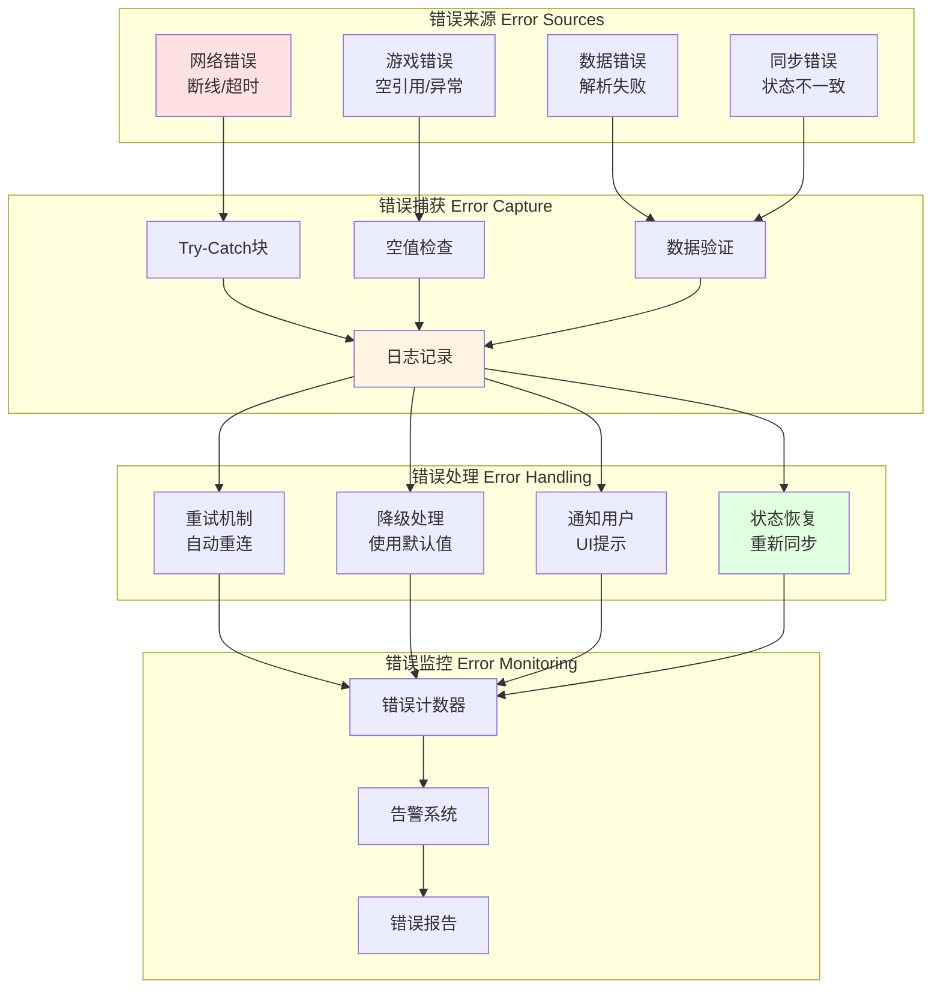
```mermaid
graph TB
    subgraph "错误来源 Error Sources"
        NetError[网络错误<br/>断线/超时]
        DataError[数据错误<br/>解析失败]
        GameError[游戏错误<br/>空引用/异常]
        SyncError[同步错误<br/>状态不一致]
    end
    
    subgraph "错误捕获 Error Capture"
        TryCatch[Try-Catch块]
        NullCheck[空值检查]
        Validation[数据验证]
        Logger[日志记录]
    end
    
    subgraph "错误处理 Error Handling"
        Retry[重试机制<br/>自动重连]
        Fallback[降级处理<br/>使用默认值]
        Notify[通知用户<br/>UI提示]
        Recovery[状态恢复<br/>重新同步]
    end
    
    subgraph "错误监控 Error Monitoring"
        Counter[错误计数器]
        Alert[告警系统]
        Report[错误报告]
    end
    
    NetError --> TryCatch
    DataError --> Validation
    GameError --> NullCheck
    SyncError --> Validation
    
    TryCatch --> Logger
    NullCheck --> Logger
    Validation --> Logger
    
    Logger --> Retry
    Logger --> Fallback
    Logger --> Notify
    Logger --> Recovery
    
    Retry --> Counter
    Fallback --> Counter
    Notify --> Counter
    Recovery --> Counter
    
    Counter --> Alert
    Alert --> Report
    
    style NetError fill:#ffe1e1
    style Logger fill:#fff4e1
    style Recovery fill:#e1ffe1
```

## 15. 完整游戏流程

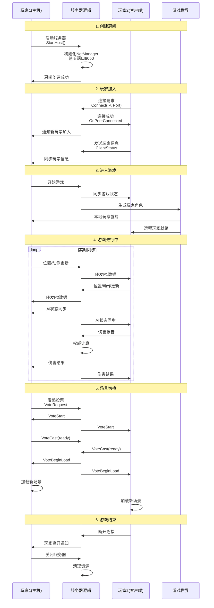
```mermaid
sequenceDiagram
    participant P1 as 玩家1(主机)
    participant Server as 服务器逻辑
    participant P2 as 玩家2(客户端)
    participant Game as 游戏世界
    
    Note over P1,Game: 1. 创建房间
    P1->>Server: 启动服务器<br/>StartHost()
    Server->>Server: 初始化NetManager<br/>监听端口9050
    Server->>P1: 房间创建成功
    
    Note over P1,Game: 2. 玩家加入
    P2->>Server: 连接请求<br/>Connect(IP, Port)
    Server->>P2: 连接成功<br/>OnPeerConnected
    Server->>P1: 通知新玩家加入
    P2->>Server: 发送玩家信息<br/>ClientStatus
    Server->>P1: 同步玩家信息
    
    Note over P1,Game: 3. 进入游戏
    P1->>Server: 开始游戏
    Server->>P2: 同步游戏状态
    Server->>Game: 生成玩家角色
    Game->>P1: 本地玩家就绪
    Game->>P2: 远程玩家就绪
    
    Note over P1,Game: 4. 游戏进行中
    loop 实时同步
        P1->>Server: 位置/动作更新
        Server->>P2: 转发P1数据
        P2->>Server: 位置/动作更新
        Server->>P1: 转发P2数据
        
        Server->>P1: AI状态同步
        Server->>P2: AI状态同步
        
        P2->>Server: 伤害报告
        Server->>Server: 权威计算
        Server->>P1: 伤害结果
        Server->>P2: 伤害结果
    end
    
    Note over P1,Game: 5. 场景切换
    P1->>Server: 发起投票<br/>VoteRequest
    Server->>P1: VoteStart
    Server->>P2: VoteStart
    P1->>Server: VoteCast(ready)
    P2->>Server: VoteCast(ready)
    Server->>P1: VoteBeginLoad
    Server->>P2: VoteBeginLoad
    P1->>P1: 加载新场景
    P2->>P2: 加载新场景
    
    Note over P1,Game: 6. 游戏结束
    P2->>Server: 断开连接
    Server->>P1: 玩家离开通知
    P1->>Server: 关闭服务器
    Server->>Server: 清理资源
```

## 16. 技术栈总览

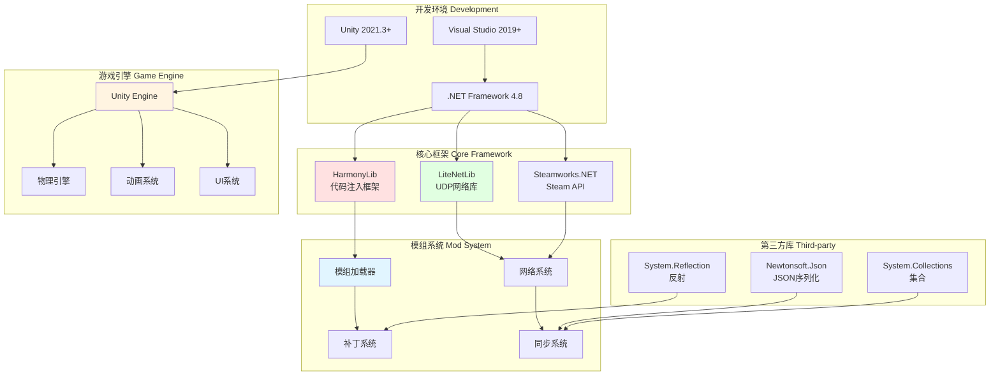
```mermaid
graph TB
    subgraph "开发环境 Development"
        VS[Visual Studio 2019+]
        NET[.NET Framework 4.8]
        Unity[Unity 2021.3+]
    end
    
    subgraph "核心框架 Core Framework"
        Harmony[HarmonyLib<br/>代码注入框架]
        LiteNet[LiteNetLib<br/>UDP网络库]
        SteamWorks[Steamworks.NET<br/>Steam API]
    end
    
    subgraph "游戏引擎 Game Engine"
        UnityEngine[Unity Engine]
        Physics[物理引擎]
        Animation[动画系统]
        UI_System[UI系统]
    end
    
    subgraph "第三方库 Third-party"
        JSON[Newtonsoft.Json<br/>JSON序列化]
        Reflection[System.Reflection<br/>反射]
        Collections[System.Collections<br/>集合]
    end
    
    subgraph "模组系统 Mod System"
        Loader[模组加载器]
        Patch[补丁系统]
        Network[网络系统]
        Sync[同步系统]
    end
    
    VS --> NET
    NET --> Harmony
    NET --> LiteNet
    NET --> SteamWorks
    
    Unity --> UnityEngine
    UnityEngine --> Physics
    UnityEngine --> Animation
    UnityEngine --> UI_System
    
    Harmony --> Loader
    Loader --> Patch
    
    LiteNet --> Network
    SteamWorks --> Network
    Network --> Sync
    
    JSON --> Sync
    Reflection --> Patch
    Collections --> Sync
    
    style Harmony fill:#ffe1e1
    style LiteNet fill:#e1ffe1
    style UnityEngine fill:#fff4e1
    style Loader fill:#e1f5ff
```

## 17. 文件结构树

```mermaid
graph TB
    Root[EscapeFromDuckovCoopMod]
    
    subgraph "Main - 核心业务"
        Main[Main/]
        AI[AI/<br/>AI同步]
        Health[Health/<br/>生命值]
        Item[Item/<br/>物品系统]
        Loader[Loader/<br/>加载器]
        LocalPlayer[LocalPlayer/<br/>本地玩家]
        Scene[SceneService/<br/>场景服务]
        UI[UI/<br/>用户界面]
        Weapon[Weapon/<br/>武器系统]
        Weather[WeatherAndTime/<br/>天气时间]
    end
    
    subgraph "Net - 网络层"
        Net[Net/]
        NetPack[NetPack.cs<br/>数据打包]
        Steam[Steam/<br/>Steam P2P]
        Messages[Messages/<br/>消息类]
        RPC[HybridRPCManager.cs<br/>RPC系统]
    end
    
    subgraph "Patch - 补丁层"
        Patch[Patch/]
        CharPatch[Character/<br/>角色补丁]
        InvPatch[InventoryAndLootBox/<br/>物品补丁]
        ItemPatch[Item/<br/>物品补丁]
        ProjPatch[Projectile/<br/>投射物补丁]
        ScenePatch[Scene/<br/>场景补丁]
        SteamPatch[SteamP2P/<br/>Steam补丁]
    end
    
    subgraph "Utils - 工具层"
        Utils[Utils/]
        CoopTool[CoopTool.cs<br/>工具函数]
        Logger[Logger/<br/>日志系统]
        Extensions[Extensions/<br/>扩展方法]
    end
    
    subgraph "Shared - 共享库"
        Shared[Shared/]
        Harmony_DLL[0Harmony.dll]
        LiteNet_DLL[LiteNetLib.dll]
    end
    
    Root --> Main
    Main --> AI
    Main --> Health
    Main --> Item
    Main --> Loader
    Main --> LocalPlayer
    Main --> Scene
    Main --> UI
    Main --> Weapon
    Main --> Weather
    
    Root --> Net
    Net --> NetPack
    Net --> Steam
    Net --> Messages
    Net --> RPC
    
    Root --> Patch
    Patch --> CharPatch
    Patch --> InvPatch
    Patch --> ItemPatch
    Patch --> ProjPatch
    Patch --> ScenePatch
    Patch --> SteamPatch
    
    Root --> Utils
    Utils --> CoopTool
    Utils --> Logger
    Utils --> Extensions
    
    Root --> Shared
    Shared --> Harmony_DLL
    Shared --> LiteNet_DLL
    
    style Main fill:#fff4e1
    style Net fill:#e1ffe1
    style Patch fill:#ffe1e1
    style Utils fill:#e1f5ff
```

## 18. 关键类关系图

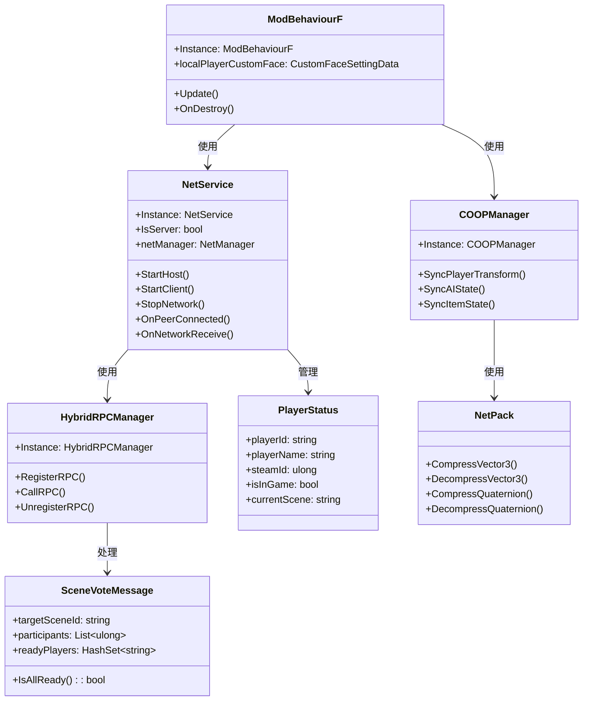
```mermaid
classDiagram
    class ModBehaviourF {
        +Instance: ModBehaviourF
        +localPlayerCustomFace: CustomFaceSettingData
        +Update()
        +OnDestroy()
    }
    
    class NetService {
        +Instance: NetService
        +IsServer: bool
        +netManager: NetManager
        +StartHost()
        +StartClient()
        +StopNetwork()
        +OnPeerConnected()
        +OnNetworkReceive()
    }
    
    class COOPManager {
        +Instance: COOPManager
        +SyncPlayerTransform()
        +SyncAIState()
        +SyncItemState()
    }
    
    class HybridRPCManager {
        +Instance: HybridRPCManager
        +RegisterRPC()
        +CallRPC()
        +UnregisterRPC()
    }
    
    class NetPack {
        +CompressVector3()
        +DecompressVector3()
        +CompressQuaternion()
        +DecompressQuaternion()
    }
    
    class PlayerStatus {
        +playerId: string
        +playerName: string
        +steamId: ulong
        +isInGame: bool
        +currentScene: string
    }
    
    class SceneVoteMessage {
        +targetSceneId: string
        +participants: List~ulong~
        +readyPlayers: HashSet~string~
        +IsAllReady(): bool
    }
    
    ModBehaviourF --> NetService : 使用
    ModBehaviourF --> COOPManager : 使用
    NetService --> HybridRPCManager : 使用
    NetService --> PlayerStatus : 管理
    COOPManager --> NetPack : 使用
    HybridRPCManager --> SceneVoteMessage : 处理
```

## 19. 设计模式应用

```mermaid
graph TB
    subgraph "单例模式 Singleton"
        NetService_S[NetService.Instance]
        COOPManager_S[COOPManager.Instance]
        ModBehaviour_S[ModBehaviourF.Instance]
        RPC_S[HybridRPCManager.Instance]
    end
    
    subgraph "观察者模式 Observer"
        Event[事件系统]
        OnConnect[OnPeerConnected]
        OnDisconnect[OnPeerDisconnected]
        OnReceive[OnNetworkReceive]
        Listeners[事件监听器]
    end
    
    subgraph "对象池模式 Object Pool"
        PacketPool[NetPacket对象池]
        WriterPool[NetDataWriter池]
        ReaderPool[NetDataReader池]
        Reuse[对象复用]
    end
    
    subgraph "工厂模式 Factory"
        MessageFactory[消息工厂]
        CreatePlayer[创建玩家消息]
        CreateAI[创建AI消息]
        CreateItem[创建物品消息]
    end
    
    subgraph "策略模式 Strategy"
        TransportStrategy[传输策略]
        UDP_Strategy[UDP策略]
        Steam_Strategy[Steam P2P策略]
        Auto_Strategy[自动选择策略]
    end
    
    subgraph "代理模式 Proxy"
        Harmony_Proxy[Harmony代理]
        Original[原始方法]
        Prefix_Proxy[前置代理]
        Postfix_Proxy[后置代理]
    end
    
    NetService_S -.实现.-> Event
    Event --> OnConnect
    Event --> OnDisconnect
    Event --> OnReceive
    OnConnect --> Listeners
    OnDisconnect --> Listeners
    OnReceive --> Listeners
    
    COOPManager_S -.使用.-> PacketPool
    PacketPool --> WriterPool
    PacketPool --> ReaderPool
    WriterPool --> Reuse
    ReaderPool --> Reuse
    
    RPC_S -.使用.-> MessageFactory
    MessageFactory --> CreatePlayer
    MessageFactory --> CreateAI
    MessageFactory --> CreateItem
    
    NetService_S -.使用.-> TransportStrategy
    TransportStrategy --> UDP_Strategy
    TransportStrategy --> Steam_Strategy
    TransportStrategy --> Auto_Strategy
    
    ModBehaviour_S -.使用.-> Harmony_Proxy
    Harmony_Proxy --> Original
    Original --> Prefix_Proxy
    Original --> Postfix_Proxy
    
    style NetService_S fill:#ffe1e1
    style Event fill:#e1ffe1
    style PacketPool fill:#fff4e1
    style MessageFactory fill:#e1f5ff
    style TransportStrategy fill:#ffe1e1
    style Harmony_Proxy fill:#e1ffe1
```

## 20. 总结与说明

### 架构特点

1. **分层架构**
   - 入口层：模组加载和初始化
   - 服务层：核心网络和管理服务
   - 业务层：具体游戏功能模块
   - 网络层：数据传输和RPC通信
   - 补丁层：游戏代码注入

2. **核心技术**
   - Harmony代码注入：无侵入式修改游戏逻辑
   - LiteNetLib：高性能UDP网络传输
   - Steam P2P：Steam平台P2P通信
   - 混合RPC系统：灵活的远程调用机制
   - Fika插值：平滑的位置同步

3. **性能优化**
   - 数据压缩：Vector3/Quaternion压缩
   - 对象池：减少GC压力
   - 多通道：避免队头阻塞
   - 智能发送：自动选择最优传输方式
   - 增量更新：只发送变化的数据

4. **可靠性保障**
   - 主机权威：防止作弊
   - 数据验证：确保数据合法性
   - 错误处理：完善的异常捕获
   - 自动重连：网络断线恢复
   - 状态同步：保证一致性

### 使用建议

1. **开发者**
   - 从整体架构图开始理解项目结构
   - 深入学习各模块的详细流程
   - 参考RPC通信架构实现新功能
   - 遵循现有的设计模式

2. **维护者**
   - 关注数据流向图理解数据传递
   - 使用操作码分类图查找相关功能
   - 参考错误处理架构完善异常处理
   - 定期检查性能优化效果

3. **贡献者**
   - 理解补丁系统架构再添加新补丁
   - 遵循文件结构树组织代码
   - 参考关键类关系图设计新类
   - 应用设计模式保持代码质量

### 相关文档

- [RPC API文档](RPC_API_Documentation.md)
- [文档索引](codeAnalysis/INDEX.md)
- [项目README](README.md)
- [模组部署流程](.kiro/steering/mod-deployment.md)

---

**文档版本**: 1.0.0  
**最后更新**: 2025-11-13  
**编写**: pansx & codex
